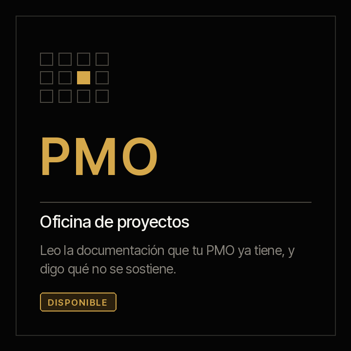

# Criterio

**Un market de familias de agentes que aceleran capacidades organizacionales.**

[English](README.md) · [Términos](TERMS.es.md) · [Descargo](DISCLAIMER.es.md) · [Cómo aportar](CONTRIBUTING.es.md)

Apache 2.0 · Se instala en cuatro clics · Cada agente produce su primer resultado en quince minutos

---

| | | |
|:--:|:--:|:--:|
|  |  |  |
| **[criterio-pmo →](families/criterio-pmo/README.es.md)**<br>tres agentes y un servidor | criterio-cfo<br>sin construir | criterio-clo<br>sin construir |

---

## El problema no es que falten herramientas

Una organización no se mueve por departamentos: se mueve por **capacidades**. La capacidad de gobernar un portafolio de proyectos. La de cerrar un mes y responder por los números. La de revisar un contrato antes de firmarlo.

Cada una tiene su método, su lenguaje y sus formas propias de fallar. Y todas comparten el mismo cuello de botella: **cientos de documentos que nadie ha leído juntos.** Actas, cronogramas, minutas, conciliaciones, contratos. Cada uno lo leyó alguien, una vez. Nadie los ha cruzado.

Las herramientas de trabajo ayudan a producir un documento más. El problema nunca fue que faltara una plantilla.

**Criterio es un market de agentes, uno por capacidad.** Leen lo que ya existe, guardan lo que encontraron con una cita por cada dato, y en la corrida siguiente dicen qué cambió.

---

## Las familias

Una **familia** agrupa a los agentes que se necesitan entre sí para cubrir una capacidad
completa. No es una categoría de catálogo: los agentes de una familia comparten un
contrato de datos y se entregan trabajo unos a otros. Los de familias distintas, no.

| Familia | Alcance | Objetivo | Estado |
|---|---|---|---|
| **[criterio-pmo](families/criterio-pmo/README.es.md)** | El gobierno de un portafolio, de cada proyecto y de cada producto | Que lo que se declara y lo que sustentan los documentos se puedan comparar, todos los días y sobre el conjunto | **Tres agentes y un servidor, instalables hoy** |
| **criterio-cfo** | El cierre, el control y el reporte financiero | Que el cierre deje de depender de que alguien recuerde qué falta | [Declarada, sin construir](plugins/criterio-finance/README.es.md) |
| **criterio-clo** | Los contratos, el cumplimiento y el riesgo legal | Que una empresa sepa qué firmó, qué vence y a qué se obligó | [Declarada, sin construir](plugins/criterio-legal/README.es.md) |

**La lista no está cerrada.** Una familia entra cuando alguien que ejerce esa capacidad
quiere construirla, y el formato está en [CONTRIBUTING.es.md](CONTRIBUTING.es.md).

## Lo que comparten todos los agentes

No es una colección de asistentes sueltos. Los tres se construyen sobre las mismas cinco
conductas, y no son estilo: son las que hacen que su salida se pueda poner frente a un comité.

1. **Cada dato lleva la cita del documento de donde salió**, con su fecha. Un dato sin fuente
   es un defecto, no un caso degradado.
2. **«No está dicho en ninguna parte» es una respuesta válida**, y es la que más se usa al
   principio.
3. **Se callan cuando no hay nada.** Ninguno produce un informe para decir que no hay novedad.
   Un agente que reporta todas las semanas haya o no noticia se ignora en un mes.
4. **Ninguno declara.** Ninguno escribe el estado de un proyecto ni decide qué se construye.
5. **Ninguno le escribe a nadie.** Producen la lista; perseguir a alguien es una conversación.

Lo que cambia entre uno y otro es **el ritmo de la conversación**, y eso está en la página de
cada uno.

## Instalación

El marketplace se agrega una vez, y después se instala lo que haga falta.

```
/plugin marketplace add josenanez-company/criterio
```

**En Claude Cowork** — Personalizar → Explorar plugins → Personal → **+** → Agregar
marketplace desde GitHub → `josenanez-company/criterio`.

**Qué instalar depende del rol que tengas, y eso lo explica cada familia.** Para la de
gobierno de proyectos, en [criterio-pmo](families/criterio-pmo/README.es.md#instalación-de-la-familia).

## Apache 2.0 — qué entregamos y a qué invitamos

**Entregamos completo y sin condiciones** el método de cada agente, el esquema de sus registros, el código que calcula, sus criterios de aceptación y la forma de medirlos.

**A qué invitamos**

- Úsalo dentro de tu organización sin pedir permiso, y adáptalo a cómo trabajas.
- Cambia los criterios: los umbrales son configuración, no código.
- **Construye la capacidad que te falta.** Si ejerces una función que no está en la lista, su agente lo escribe quien conoce el trabajo, no quien sabe programar. El formato está en [CONTRIBUTING.es.md](CONTRIBUTING.es.md).
- Si encuentras que se equivoca, ábrelo como issue con el documento que lo demuestra. Vale más que una estrella.

**Lo que no afirmamos**

Esto produce borradores de trabajo, no decisiones. Nadie ha certificado nada aquí. Los agentes saben lo que se escribió, no lo que se habló fuera de los documentos. Lee el [descargo](DISCLAIMER.es.md) antes de instalar: usarlo implica aceptar los [términos](TERMS.es.md).

---

Mantenido por [José Francisco Ñáñez](https://josenanez.com).

---

Mantenido por [José Francisco Ñáñez](https://josenanez.com).

---

Mantenido por [José Francisco Ñáñez](https://josenanez.com).
