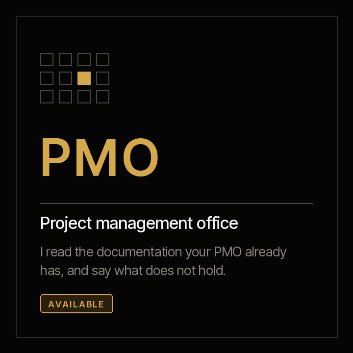
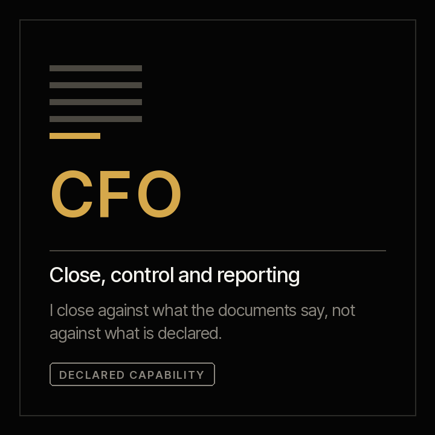
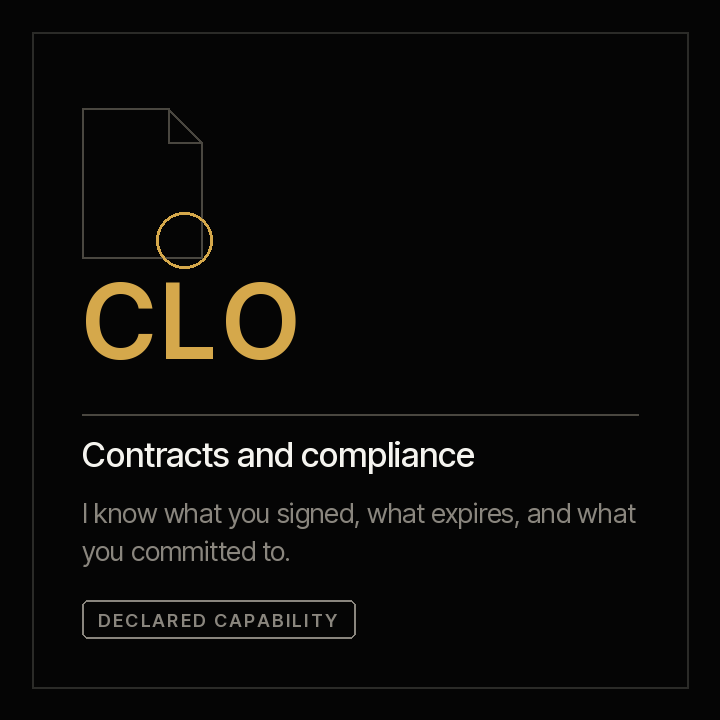

# Criterio

**A marketplace of agents that accelerate organisational capabilities.**

[Español](README.es.md) · [Terms](TERMS.md) · [Disclaimer](DISCLAIMER.md) · [Contributing](CONTRIBUTING.md)

Apache 2.0 · Four clicks to install · Each agent produces its first result in fifteen minutes

---

| | | |
|:--:|:--:|:--:|
| [](plugins/criterio-pmo/README.md) |  |  |
| **[See the PMO family →](plugins/criterio-pmo/README.md)** | Not built | Not built |

---

## The problem was never a missing tool

An organisation does not move by departments: it moves by **capabilities**. The capability to govern a portfolio of projects. To close a month and answer for the numbers. To review a contract before signing it.

Each has its own method, its own language and its own ways of failing. And they all share the same bottleneck: **hundreds of documents nobody has read together.** Charters, schedules, minutes, reconciliations, contracts. Each was read by someone, once. Nobody has cross-read them.

Work tools help you produce one more document. The problem was never a missing template.

**Criterio is a marketplace of agents, one per capability.** They read what already exists, keep a record of what they found with a citation for every data point, and on the next run say what changed.

---

## The capabilities

### PMO — portfolio and project governance

**What it is.** The function that answers for the projects as a whole: what is running, against which plan, on what budget and with what risks. Its components are demand prioritisation, planning and baselining, tracking against plan, the register of risks and dependencies, change control, budget, vendors, the steering committee and closure.

**What it costs today**

| Figure | Source |
|---|---|
| IT projects run a mean cost overrun of **73%**, and 18% overrun by more than 50% | [Flyvbjerg et al., *Project Management Journal*, 2026](https://journals.sagepub.com/doi/10.1177/87569728251340590) — 11,011 projects, 126 countries |
| **31%** of complex projects fail to achieve the benefits they set out to deliver | [PMI, *Pulse of the Profession* 2026](https://www.pmi.org/learning/thought-leadership/driving-success-in-complex-projects) — 2,534 respondents, 35 countries |
| **72%** spend half a day or more every month just collating reports by hand, and half have no real-time indicators | [Wellingtone, *State of Project Management* 2026](https://wellingtone.co.uk/publications/state-of-project-management-research/) |
| **A third of projects have no baseline**, and 22% are still planned in Excel | Wellingtone 2026 |
| **93%** of organisations above one billion dollars in revenue have a PMO | [PM Solutions, *State of the PMO* 2025](https://www.pmsolutions.com/uploads/files/uploads/files/State_of_the_PMO_2025_Research_Report.pdf) — 134 organisations |

A third with no baseline means a third of projects **have nothing to be measured against**. That is not a tooling problem: it is that nobody went back to look.

**What we attack.** Not the lack of templates: there are plenty. We attack the fact that **nobody has read together the documentation that already exists.** Each document was read by someone, once. Nobody has cross-read them, and the crossing is what decides:

- The milestone whose date passed with **not a single document proving it was met**.
- The project reporting green that **has not produced a document in five weeks**.
- Last week's minutes **naming a sponsor different** from the one in the charter.
- The dependency one plan declares and **the other project's plan ignores**.
- The commitment someone made in **three consecutive meetings, with a new date each time**.
- The rebaseline that turned the light back to green and **erased a year of accumulated slippage**.

None of that shows up in a status report. **The status report is written by the person being assessed.**

Two decisions you notice on day one. **Four budget figures, not two:** a project at 40% executed and 95% committed has no headroom — its budget is spent and not yet incurred, and that is invisible if you look at executed against approved. **Silence is measured:** a project with no documentation is not badly run, it is undocumented, and that is a different finding that also has to be said.

**The PMO family has more than one agent because the organisation has more than one role.** They carry people's names because they are capabilities that extend people, and each name's meaning points at what it does.

| | | |
|---|---|---|
| **[Vera](plugins/criterio-pmo/README.md)** | PMO agent · **available** | *Verus*, the true. Says what the documents say, not what gets reported. 17 commands, 10 skills |
| **[Samuel](plugins/criterio-pm/README.md)** | Project agent · **available** | "He who heard". Its central function is the commitment said and not kept. 6 commands, 8 skills |
| **[Alba](plugins/criterio-product/README.md)** | Product agent · **available** | Daybreak: the light there is before anything can be seen. Works before the project exists. 7 commands, 12 skills |
| **[Rostrum](plugins/criterio-pmo/SERVER.md)** | The server · **available** | A lectern. Holds up what is already written, where the team can read it |

Rostrum is the only one without a person's name, and that is deliberate: the agents decide about what they read, and the server decides nothing.

---

### CFO — close, control and financial reporting

**What it is.** The function that closes the books and answers for what they say. Its components are the close and consolidation, reconciliations, book-to-tax, reporting to supervisors and audit preparation.

**What it costs today**

| Figure | Source |
|---|---|
| **18%** of accountants make errors daily and **59%** several per month, due to capacity constraints | [Gartner, Feb 2024](https://www.gartner.com/en/newsroom/press-releases/2024-02-21-gartner-survey-shows-that-a-third-of-accountants-make-several-error-per-weeo-due-to-capacity-constraints) — 497 accountants, surveyed Jul 2023 |
| Annual close: **10 days** for top performers, **18** at the median, **35** for laggards | [APQC, Apr 2026](https://www.apqc.org/resources/blog/how-streamline-annual-closing-process-and-speed-up-year-end-close) |
| The quarterly close got **worse**: 49% closed within six business days in 2019, 44% in 2023 | [Ventana Research / ISG, Dec 2023](https://research.isg-one.com/analyst-perspectives/research-reveals-the-importance-of-technology-in-shortening-the-close) |
| SOX programme hours rose **32% in two years**, to 15,580. **45% of controls remain fully manual** | [KPMG, *SOX Survey* 2025](https://kpmg.com/us/en/articles/2025/2025-kpmg-sox-survey.html) — ~150 professionals |

The figure that should sting is the third: **the close did not improve in four years**, despite everything spent on technology.

→ CFO Agent: capability declared, not built

---

### CLO — contracts, compliance and legal risk

**What it is.** The function that answers for what the company signed. Its components are contract review, the repository of what was executed, tracking obligations and expiries, regulatory compliance and disputes.

**What it costs today**

| Figure | Source |
|---|---|
| Poor contract management erodes an average of **8.6% of contract value** — 3% for the best, over 20% for the worst | [World Commerce & Contracting with Deloitte, 2023](https://info.worldcc.com/roi) — 1,236 organisations |
| Contracting teams spend **over 40% of their time and budget** on low-complexity contracts | [EY with Harvard Law School, 2021](https://clp.law.harvard.edu/wp-content/uploads/2022/10/ey-contracting-report-june-2021.pdf) — 1,000 professionals, 22 countries |
| A large organisation handles **19,000 contracts a year**, and **90% have difficulty locating their own** | EY / Harvard Law School, 2021 |
| Only **27%** keep all their executed contracts in a single repository | [Sirion and World Commerce & Contracting, 2026](https://www.sirion.ai/press/trusted-contract-data-world-cc-research-report/) — 170 companies |

A company that cannot find its own contracts cannot know what it signed, what expires, or what it committed to.

→ CLO Agent: capability declared, not built

---

The list is not closed. **A capability joins when someone who practises it wants to build its agent.**

---

## Installation

**Claude Cowork** — Customize → Browse plugins → Personal → **+** → Add marketplace from GitHub → `josenanez-company/criterio`

**Claude Code**

```
/plugin marketplace add josenanez-company/criterio
/plugin install criterio-pmo@criterio     if you run the portfolio
/plugin install criterio-pm@criterio      if you run a project
/plugin install criterio-product@criterio if you define a product
```

After installing, each agent has a setup command that looks at your folders, asks five questions and produces a first result on your own documents. **Nobody edits a configuration file by hand.**

---

## What every agent shares

This is not a collection of loose assistants. They are all built on the same rules, and that is what makes their output survive a committee.

**They separate what is declared from what is evidenced.** What someone asserts goes in one column; what the documents support goes in another. They are never merged, and the gap between them is usually the highest-value finding.

**Nothing is overwritten.** A record keeps its history. When a new version silently replaces the previous one, what disappears is exactly what needed to be seen.

**The model extracts; code computes.** Reading a date is reading. Subtracting, projecting and adding is arithmetic, and arithmetic lives in code, where it is deterministic and testable. No number in a report comes from the model's estimate.

This is not a technical detail. The available research on operational spreadsheets — [Powell, Baker and Lawson, 2009](http://mba.tuck.dartmouth.edu/spreadsheet/product_pubs_files/errors.pdf), 50 audited spreadsheets, 270,722 formulas — found errors in 94% of them. Worth saying plainly that this is the most recent field study of its kind and it is now old: no comparable replication has been published. An agent that estimates numbers instead of computing them adds another layer to that same problem.

**Every data point carries its citation, or declares that it is missing.** *"Not stated anywhere"* is a valid and expected finding.

**And they know when to stay quiet.** They run on their own and speak only when something crosses a threshold. An agent that reports every week whether or not there is news is ignored within a month.

---

## Evidence

Each capability publishes the figures from its real runs: how many documents, how long it took, how many findings, and which of them nobody had seen. Together with the procedure for anyone to reproduce them.

**What has not been measured is not invented.** The figures on this page are third-party and carry their source, their year and their sample. Ours go up when they exist. Until a capability has real runs, its page says so.

What can be verified today, by cloning the repository:

```
python3 scripts/verificar.py
```

One door, thirteen checks: the synthetic material, both plugins' arithmetic, the hand-written answers, and that the documentation says what the code does. **On the standard library, with nothing installed** — if any of this needed a dependency, the property that makes this repository auditable would be broken.

What each run proves and, with the same candour, **what it does not**, in [`tests/criterio-pmo/EVIDENCIA.md`](tests/criterio-pmo/EVIDENCIA.md) and [`tests/criterio-pm/EVIDENCIA.md`](tests/criterio-pm/EVIDENCIA.md) — in Spanish, as working documents.

**The last run's results, per agent and combined, with charts and with what has not been tested yet:** [`docs/pruebas.html`](docs/pruebas.html) — generated by `python3 scripts/resultados.py`, from running the gates rather than writing them down.

---

## Apache 2.0 — what we give and what we invite

**We give, in full and with no conditions,** each agent's method, its record schemas, the code that computes, its acceptance criteria and the way to measure them.

**What we invite**

- Use it inside your organisation without asking, and adapt it to how you work.
- Change the criteria: thresholds are configuration, not code.
- **Build the capability you are missing.** If you practise a function that is not on the list, its agent should be written by someone who knows the work, not by someone who knows how to code. The format is in [CONTRIBUTING.md](CONTRIBUTING.md).
- If you find it wrong, open an issue with the document that proves it. That is worth more than a star.

**What we do not claim**

This produces working drafts, not decisions. Nothing here has been certified by anyone. The agents know what was written, not what was said outside the documents. Read the [disclaimer](DISCLAIMER.md) before installing: using it means accepting the [terms](TERMS.md).

---

Maintained by [José Francisco Ñáñez](https://josenanez.com).
