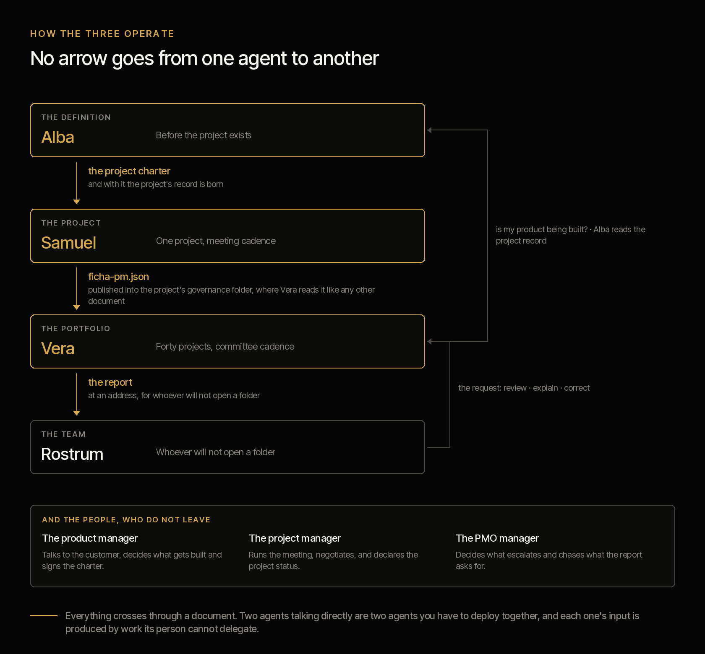
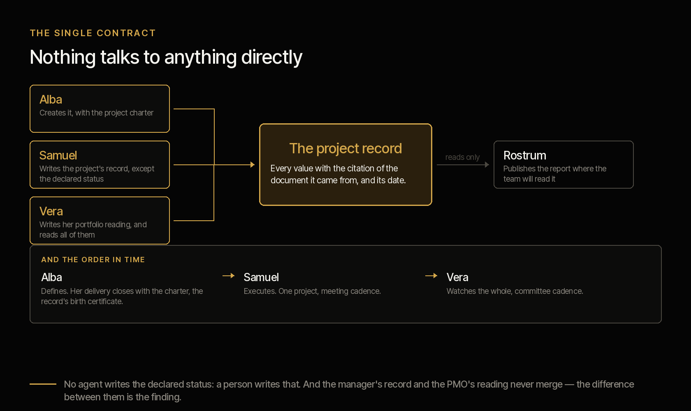

# Criterio

**A marketplace of agents that accelerate organisational capabilities.**

[Español](README.es.md) · [Terms](TERMS.md) · [Disclaimer](DISCLAIMER.md) · [Contributing](CONTRIBUTING.md)

Apache 2.0 · Four clicks to install · Each agent produces its first result in fifteen minutes

---

| | | |
|:--:|:--:|:--:|
| [](plugins/criterio-pmo/README.md) |  |  |
| **[See the PMO family →](plugins/criterio-pmo/README.md)** | Not built | Not built |

---

## The problem was never a missing tool

An organisation does not move by departments: it moves by **capabilities**. The capability to govern a portfolio of projects. To close a month and answer for the numbers. To review a contract before signing it.

Each has its own method, its own language and its own ways of failing. And they all share the same bottleneck: **hundreds of documents nobody has read together.** Charters, schedules, minutes, reconciliations, contracts. Each was read by someone, once. Nobody has cross-read them.

Work tools help you produce one more document. The problem was never a missing template.

**Criterio is a marketplace of agents, one per capability.** They read what already exists, keep a record of what they found with a citation for every data point, and on the next run say what changed.

---

## The capabilities

### PMO — portfolio and project governance

**What it is.** The function that answers for the projects as a whole: what is running, against which plan, on what budget and with what risks. Its components are demand prioritisation, planning and baselining, tracking against plan, the register of risks and dependencies, change control, budget, vendors, the steering committee and closure.

**What it costs today**

| Figure | Source |
|---|---|
| IT projects run a mean cost overrun of **73%**, and 18% overrun by more than 50% | [Flyvbjerg et al., *Project Management Journal*, 2026](https://journals.sagepub.com/doi/10.1177/87569728251340590) — 11,011 projects, 126 countries |
| **31%** of complex projects fail to achieve the benefits they set out to deliver | [PMI, *Pulse of the Profession* 2026](https://www.pmi.org/learning/thought-leadership/driving-success-in-complex-projects) — 2,534 respondents, 35 countries |
| **72%** spend half a day or more every month just collating reports by hand, and half have no real-time indicators | [Wellingtone, *State of Project Management* 2026](https://wellingtone.co.uk/publications/state-of-project-management-research/) |
| **A third of projects have no baseline**, and 22% are still planned in Excel | Wellingtone 2026 |
| **93%** of organisations above one billion dollars in revenue have a PMO | [PM Solutions, *State of the PMO* 2025](https://www.pmsolutions.com/uploads/files/uploads/files/State_of_the_PMO_2025_Research_Report.pdf) — 134 organisations |

A third with no baseline means a third of projects **have nothing to be measured against**. That is not a tooling problem: it is that nobody went back to look.

**What we attack.** Not the lack of templates: there are plenty. We attack the fact that **nobody has read together the documentation that already exists.** Each document was read by someone, once. Nobody has cross-read them, and the crossing is what decides:

- The milestone whose date passed with **not a single document proving it was met**.
- The project reporting green that **has not produced a document in five weeks**.
- Last week's minutes **naming a sponsor different** from the one in the charter.
- The dependency one plan declares and **the other project's plan ignores**.
- The commitment someone made in **three consecutive meetings, with a new date each time**.
- The rebaseline that turned the light back to green and **erased a year of accumulated slippage**.

None of that shows up in a status report. **The status report is written by the person being assessed.**

Two decisions you notice on day one. **Four budget figures, not two:** a project at 40% executed and 95% committed has no headroom — its budget is spent and not yet incurred, and that is invisible if you look at executed against approved. **Silence is measured:** a project with no documentation is not badly run, it is undocumented, and that is a different finding that also has to be said.

**The PMO family has more than one agent because the organisation has more than one role.** They carry people's names because they are capabilities that extend people, and each name's meaning points at what it does.

| | | |
|---|---|---|
| **[Vera](plugins/criterio-pmo/README.md)** | PMO agent · **available** | *Verus*, the true. Says what the documents say, not what gets reported. 17 commands, 10 skills |
| **[Samuel](plugins/criterio-pm/README.md)** | Project agent · **available** | "He who heard". Its central function is the commitment said and not kept. 9 commands, 8 skills |
| **[Alba](plugins/criterio-product/README.md)** | Product agent · **available** | Daybreak: the light there is before anything can be seen. Works before the project exists. 11 commands, 12 skills |
| **[Rostrum](plugins/criterio-pmo/SERVER.md)** | The server · **available** | A lectern. Holds up what is already written, where the team can read it |

Rostrum is the only one without a person's name, and that is deliberate: the agents decide about what they read, and the server decides nothing.

---

### CFO — close, control and financial reporting

**What it is.** The function that closes the books and answers for what they say. Its components are the close and consolidation, reconciliations, book-to-tax, reporting to supervisors and audit preparation.

**What it costs today**

| Figure | Source |
|---|---|
| **18%** of accountants make errors daily and **59%** several per month, due to capacity constraints | [Gartner, Feb 2024](https://www.gartner.com/en/newsroom/press-releases/2024-02-21-gartner-survey-shows-that-a-third-of-accountants-make-several-error-per-weeo-due-to-capacity-constraints) — 497 accountants, surveyed Jul 2023 |
| Annual close: **10 days** for top performers, **18** at the median, **35** for laggards | [APQC, Apr 2026](https://www.apqc.org/resources/blog/how-streamline-annual-closing-process-and-speed-up-year-end-close) |
| The quarterly close got **worse**: 49% closed within six business days in 2019, 44% in 2023 | [Ventana Research / ISG, Dec 2023](https://research.isg-one.com/analyst-perspectives/research-reveals-the-importance-of-technology-in-shortening-the-close) |
| SOX programme hours rose **32% in two years**, to 15,580. **45% of controls remain fully manual** | [KPMG, *SOX Survey* 2025](https://kpmg.com/us/en/articles/2025/2025-kpmg-sox-survey.html) — ~150 professionals |

The figure that should sting is the third: **the close did not improve in four years**, despite everything spent on technology.

→ CFO Agent: capability declared, not built

---

### CLO — contracts, compliance and legal risk

**What it is.** The function that answers for what the company signed. Its components are contract review, the repository of what was executed, tracking obligations and expiries, regulatory compliance and disputes.

**What it costs today**

| Figure | Source |
|---|---|
| Poor contract management erodes an average of **8.6% of contract value** — 3% for the best, over 20% for the worst | [World Commerce & Contracting with Deloitte, 2023](https://info.worldcc.com/roi) — 1,236 organisations |
| Contracting teams spend **over 40% of their time and budget** on low-complexity contracts | [EY with Harvard Law School, 2021](https://clp.law.harvard.edu/wp-content/uploads/2022/10/ey-contracting-report-june-2021.pdf) — 1,000 professionals, 22 countries |
| A large organisation handles **19,000 contracts a year**, and **90% have difficulty locating their own** | EY / Harvard Law School, 2021 |
| Only **27%** keep all their executed contracts in a single repository | [Sirion and World Commerce & Contracting, 2026](https://www.sirion.ai/press/trusted-contract-data-world-cc-research-report/) — 170 companies |

A company that cannot find its own contracts cannot know what it signed, what expires, or what it committed to.

→ CLO Agent: capability declared, not built

---

The list is not closed. **A capability joins when someone who practises it wants to build its agent.**

---

## The PMO family


The capability has more than one agent because the organisation has more than one role.
They carry people's names because **they are capabilities that extend people**, and each
name's meaning points at what it does: **Vera** — from *verus*, the true — says what the
documents say rather than what gets reported; **Samuel** — "he who heard" — remembers on
Friday what was said in the meeting; **Alba** — daybreak — works before the project
dawns.

**All three install today**, each with its own plugin, and they share the same data
contract. All three also carry the same debt, written on their own page: built and
verified over a synthetic corpus, **not yet tested against a real organisation's
documentation.**

**Samuel**, the project manager's agent, does not attend the meetings — the manager does. What it does is let the
manager arrive with the week prepared: the agenda built beforehand, the minutes drafted
afterwards, the plan current against the evidence, and the report ready except for one line.
Its central function is one no tool a project manager uses today performs: **the commitment
said and not kept.** Meetings are full of *"I'll have it by Friday"* and nobody records them.

**Alba** works before the project exists, and delivers the charter the project
is born from.

## How the three operate



The order in time is what makes them a system rather than three tools. **Two closed loops, and neither goes through a shared database.** The charter comes down once,
and with it the record is born. The manager's record goes up published as one more document of
the project, and Vera reads it like everything else. The report goes out to the team, and from
the team a request comes back. And the loop at the top: Alba reads the project records to
confirm that whoever claims to be building her product actually is.

What is **not** in that picture matters as much as what is:

- **No arrow between two agents.** Every one of them passes through a document. Two agents
  talking directly are two agents you have to deploy together.
- **No arrow back from Rostrum into the record.** The server does not write.
- **No arrow that writes the declared status.** A person writes that, in all three places where
  it appears.

**And the people are in the same picture, at the bottom.** Each agent's input is produced by work its person cannot delegate.** Removing the person does
not leave the agent alone: it leaves it without food.

## The three agents and the single contract

Nothing talks to anything directly. **The project record is the only contract.**



The Product Manager works before a plan exists: it does not write into the record, **it creates
it.** Its delivery closes with the charter, which is the record's birth certificate.

## The three agents' commands

Thirty-seven commands, and each one lives in its agent's plugin. This is the family's full list; the detail of each one is on its plugin's page.

### Vera · `criterio-pmo` · seventeen

| Command | What it does |
|---|---|
| `/pmo-setup` | **The first thing you run.** Looks at your folders, asks five questions and produces the first report over your own documents |
| `/pmo-wake` | **What the clock invokes.** Looks at what is due today, does it, and stays quiet if nothing is |
| `/pmo-server` | Raises **Rostrum**, the server: exposes the report for whoever does not open a folder, and says what to ask the organisation for |
| `/document-index` | Which documents actually changed, what has to be re-read, and which citations stopped resolving |
| `/portfolio-scan` | Reads the folder and produces or updates one record per project. The way in |
| `/portfolio-report` | Consolidated report: what changed, what contradicts itself, what is silent, what has no support |
| `/status-report` | A project's status, and the signals its declared light does not account for |
| `/health-check` | Diagnoses a project from zero against the evidence, assuming nothing from its own report |
| `/project-history` | What happened in a project, with the timeline and since when the declared status stopped holding |
| `/steering-pack` | Committee material as a package of decisions, not as a progress report |
| `/raid-log` | Risks, assumptions, issues and dependencies, including the ones said aloud that nobody recorded |
| `/change-control` | Assesses a change across scope, time and cost, and creates a new baseline without deleting the previous one |
| `/budget-tracking` | Approved, committed, executed and projection, with variance against both baselines |
| `/vendor-tracking` | Contractual deliverables against evidence of receipt and against invoicing |
| `/product-view` | The state of a product across every project that builds it |
| `/project-charter` | Reviews or drafts the charter, flagging what is missing and what the gap costs |
| `/project-closure` | Closes against the agreed success criteria, with lessons that can be supported |

### Samuel · [`criterio-pm`](plugins/criterio-pm/README.md) · nine

| Command | What it does |
|---|---|
| `/pm-setup` | **The first thing you run.** Looks at your folder, asks four questions and reads your latest minutes |
| `/pm-agenda` | The agenda with the items that need somebody in the room, and with what this meeting cannot move |
| `/pm-minutes` | The minutes from the transcript or the notes, with every item attributed to a person |
| `/pm-commitments` | Who promised what, what is overdue with no evidence, and what keeps being rescheduled meeting after meeting |
| `/pm-report` | The weekly report, complete **except for the status**, which you declare |
| `/pm-publish` | Publishes your record where the PMO can read it |
| `/pm-plan` | The first draft of the plan and the WBS from the charter, **committing no date** |
| `/pm-escalate` | What exceeds your authority, as a closed question, with who it reaches computed |
| `/pm-wake` | **The one you put on a clock.** Looks at what is due around your meeting, and stays quiet when nothing is |

### Alba · [`criterio-product`](plugins/criterio-product/README.md) · eleven

| Command | What it does |
|---|---|
| `/product-setup` | **The first thing you run.** Looks at your folder, asks four questions and contrasts the definition you already have |
| `/product-discovery` | Interviews and tickets into themes with the citation of who said it, and the theme said for months that nobody has turned into anything |
| `/product-requirements` | The register with its gaps: no owner, no acceptance criteria, accepted with nobody having asked for it, and what nobody decides |
| `/product-definition` | The definition against the evidence of demand, and where business and data disagree |
| `/product-trace` | Requirement → decision → project → deliverable, and the two gaps above |
| `/product-spec` | The specification draft with verifiable criteria and the gaps marked, not filled |
| `/product-charter` | The charter: where the record is born and the writer changes hands |
| `/product-business-case` | The business case's structure with every figure cited, and the gaps with who produces them |
| `/product-publish` | Publishes your record where the other products can read it |
| `/product-overlap` | Where you overlap another product: the same metric counted twice, the same project, the same segment |
| `/product-wake` | **The one you put on a clock.** What crossed a threshold with nobody doing anything |

**The only one that is not an agent's** is `/pmo-server`: Vera runs it, and what it starts is Rostrum, which decides nothing.

## And the family's eighteen

Eighteen distinct skills across the three agents. **What they share are literal copies, not an imported module**: an installed plugin has to run on its own, and an `import` into the other one's path works here and fails on the machine of whoever installed it.

`scripts/sincronizar.py` copies them and `tests/coherencia.py` fails if they drift apart.

| Skill | Vera | Samuel | Alba |
|---|:--:|:--:|:--:|
| `assumption-tracking` | · | · | ● |
| `baseline-variance` | ● | ● | · |
| `commitment-tracking` | ● | ● | · |
| `demand-evidence` | · | · | ● |
| `discovery-synthesis` | · | · | ● |
| `document-intake` | ● | ● | ● |
| `governance-artifacts` | ● | ● | ● |
| `portfolio-health` | ● | · | · |
| `portfolio-history` | ● | · | · |
| `product-health` | · | · | ● |
| `product-metrics` | · | · | ● |
| `project-diagnosis` | ● | ● | · |
| `project-record` | ● | ● | ● |
| `raid-taxonomy` | ● | ● | ● |
| `regulatory-sweep` | · | · | ● |
| `requirement-record` | · | · | ● |
| `specification-draft` | · | · | ● |
| `vendor-control` | ● | ● | · |

## Status

**All three are built and can be installed today**, and all three carry the same debt, which is
better not hidden: **verified over a synthetic corpus, not tested against a real organisation's
documentation.**

| Agent | Installs as | Its A and B tables |
|---|---|---|
| Vera · PMO | `criterio-pmo` · 17 commands, 10 skills | **No open rows** |
| Samuel · Project Manager | `criterio-pm` · 9 commands, 8 skills | **No open rows** |
| Alba · Product Manager | `criterio-product` · 11 commands, 12 skills | **No open rows** |
| Rostrum · the server | Inside `criterio-pmo` | — |

**None of the three design sheets has a row left in "missing" or "partial".** What remains
is not construction.

And one debt that belongs to all three at once: **extraction has never been run.** The three
corpora seed the state from their reference answers, so the document → model → record chain has
not been exercised.

The run that supports these states, with what it proves and what it does not, is in the three
evidence pages under [`tests/`](tests/) and, drawn, in
[`docs/pruebas.html`](docs/pruebas.html).

## Installation

**Claude Cowork** — Customize → Browse plugins → Personal → **+** → Add marketplace from GitHub → `josenanez-company/criterio`

**Claude Code**

```
/plugin marketplace add josenanez-company/criterio
/plugin install criterio-pmo@criterio     if you run the portfolio
/plugin install criterio-pm@criterio      if you run a project
/plugin install criterio-product@criterio if you define a product
```

After installing, each agent has a setup command that looks at your folders, asks five questions and produces a first result on your own documents. **Nobody edits a configuration file by hand.**

**How often each one runs, what you have to tell it and which command goes on a clock:** [`plugins/criterio-pmo/README.md`](plugins/criterio-pmo/README.md) — **the family's page**: how the three operate together, how you work with each one, and how often each runs. None of them schedules itself — all three ship the command a clock invokes, and the clock lives outside the plugin.

---

## How each one is configured and how often it runs

| | Vera | Samuel | Alba |
|---|---|---|---|
| **Installs as** | `criterio-pmo` | `criterio-pm` | `criterio-product` |
| **Instances** | One per PMO | **One per project** | **One per product** |
| **Configured with** | `/pmo-setup` | `/pm-setup` | `/product-setup` |
| **How long that takes** | Fifteen minutes | Ten | Ten |
| **What you have to tell it** | Where the documentation is, when the committee meets, who you are | Where your project is, when your meeting is, who you are | Where the definition is, who decides what gets built, who you are |
| **Where it lands** | A file of the person's, written by the command | Same | Same |
| **The one you put on a clock** | `/pmo-wake` | `/pm-wake` | `/product-wake` |
| **Cadence that makes sense** | Daily if the sweep is on; and the report with its lead time before the committee | Daily with the sweep, or the day before and the day after the meeting | **Weekly is enough** |
| **What wakes it besides the clock** | A request somebody left in Rostrum | New minutes in the folder | Something crossing a threshold on its own |

**Nobody edits a configuration file by hand.** It is a rule of all three setup commands, not a
courtesy: if changing a threshold means opening a JSON, the threshold stays as it shipped and
the configuration stops describing the organisation. You say it in the conversation and the
command rewrites it.

Each plugin ships its `scripts/config.example.json` so you can see the full shape without
installing anything.

### Why the three cadences are different

It is not a preference: **each agent measures against something else.**

- **Vera** measures against the folder. A new document can change a project's state today, so a
  daily sweep makes sense and the report is delivered ahead of the committee — so the PMO
  manager has time to react to what it finds, not to learn about it once it has been sent.
- **Samuel** measures against the meeting. His cycle is not the calendar: it is *before the
  meeting* and *after the meeting*, which is why `/pm-wake` checks which side you are on before
  offering anything.
- **Alba** measures against the passing of time, and that changes everything. Her thresholds are
  counted in months, so a daily run over a register that barely moves is noise with punctuality.
  **But she is the only one of the three whose findings appear with nobody doing anything**: the
  requirement that had gone fifty-nine days undecided reaches sixty, and nobody is going to open
  a session to ask whether that has happened yet.

### All three go quiet when there is nothing

It is the rule that decides whether an agent is still installed a month later. The three clock
commands return `quiet` when nothing is due, and with `quiet` the output is one line: what was
reviewed and when it comes back.

An agent that produces a report to say there is no news teaches you to ignore it, and the day
there is news nobody opens it.

### What is **not** scheduled

Worth saying here and not in a footnote: **none of the three schedules itself.** All three ship
the command a clock invokes, and the clock lives outside the plugin — a Claude Cowork scheduled
task, or the operating system's scheduler invoking Claude non-interactively. Somebody has to
set it up, once, and each clock command explains how.

And for it to run with nobody watching, two things are needed that do not depend on this
repository: **that the session can run without approving each step**, and **that the folder is
mounted when the clock fires.**

**If the organisation does not want unattended runs** — and in a bank that is a reasonable
answer — all three commands work run by hand, and the cadence still says what is due. What is
lost is that they warn you without anybody asking, which is exactly what is hardest to see by
hand.

## What every agent shares

This is not a collection of loose assistants. They are all built on the same rules, and that is what makes their output survive a committee.

**They separate what is declared from what is evidenced.** What someone asserts goes in one column; what the documents support goes in another. They are never merged, and the gap between them is usually the highest-value finding.

**Nothing is overwritten.** A record keeps its history. When a new version silently replaces the previous one, what disappears is exactly what needed to be seen.

**The model extracts; code computes.** Reading a date is reading. Subtracting, projecting and adding is arithmetic, and arithmetic lives in code, where it is deterministic and testable. No number in a report comes from the model's estimate.

This is not a technical detail. The available research on operational spreadsheets — [Powell, Baker and Lawson, 2009](http://mba.tuck.dartmouth.edu/spreadsheet/product_pubs_files/errors.pdf), 50 audited spreadsheets, 270,722 formulas — found errors in 94% of them. Worth saying plainly that this is the most recent field study of its kind and it is now old: no comparable replication has been published. An agent that estimates numbers instead of computing them adds another layer to that same problem.

**Every data point carries its citation, or declares that it is missing.** *"Not stated anywhere"* is a valid and expected finding.

**And they know when to stay quiet.** They run on their own and speak only when something crosses a threshold. An agent that reports every week whether or not there is news is ignored within a month.

---

## What still belongs to the people

All three roles continue to exist in full. This extends capability; it does not replace
function. And the argument is not politeness, it is structural:

> **Each agent's input is produced by the non-delegable work of its person.**

The PM agent needs somebody to run the meeting, because that is where the minutes it feeds on
come from. The PMO agent needs somebody to chase what the report asks for, because if nobody
acts the next report says the same thing. The product agent needs somebody to talk to the
customer, because there is no synthesis without an interview.

Removing the person does not leave the agent alone: it leaves it without food. Each design
sheet documents what breaks first if you try, and in what order.

## Evidence

Each capability publishes the figures from its real runs: how many documents, how long it took, how many findings, and which of them nobody had seen. Together with the procedure for anyone to reproduce them.

**What has not been measured is not invented.** The figures on this page are third-party and carry their source, their year and their sample. Ours go up when they exist. Until a capability has real runs, its page says so.

What can be verified today, by cloning the repository:

```
python3 scripts/verificar.py
```

One door, thirteen checks: the synthetic material, both plugins' arithmetic, the hand-written answers, and that the documentation says what the code does. **On the standard library, with nothing installed** — if any of this needed a dependency, the property that makes this repository auditable would be broken.

What each run proves and, with the same candour, **what it does not**, in [`tests/criterio-pmo/EVIDENCIA.md`](tests/criterio-pmo/EVIDENCIA.md) and [`tests/criterio-pm/EVIDENCIA.md`](tests/criterio-pm/EVIDENCIA.md) — in Spanish, as working documents.

**The last run's results, per agent and combined, with charts and with what has not been tested yet:** [`docs/pruebas.html`](docs/pruebas.html) — generated by `python3 scripts/resultados.py`, from running the gates rather than writing them down.

---

## Apache 2.0 — what we give and what we invite

**We give, in full and with no conditions,** each agent's method, its record schemas, the code that computes, its acceptance criteria and the way to measure them.

**What we invite**

- Use it inside your organisation without asking, and adapt it to how you work.
- Change the criteria: thresholds are configuration, not code.
- **Build the capability you are missing.** If you practise a function that is not on the list, its agent should be written by someone who knows the work, not by someone who knows how to code. The format is in [CONTRIBUTING.md](CONTRIBUTING.md).
- If you find it wrong, open an issue with the document that proves it. That is worth more than a star.

**What we do not claim**

This produces working drafts, not decisions. Nothing here has been certified by anyone. The agents know what was written, not what was said outside the documents. Read the [disclaimer](DISCLAIMER.md) before installing: using it means accepting the [terms](TERMS.md).

---

Maintained by [José Francisco Ñáñez](https://josenanez.com).
