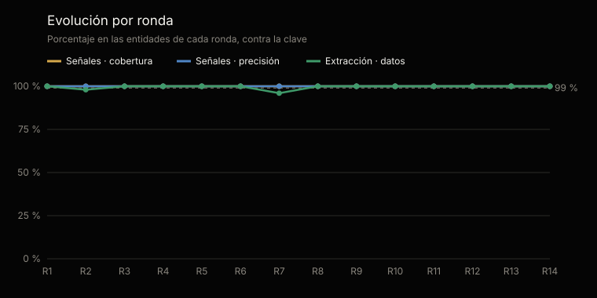
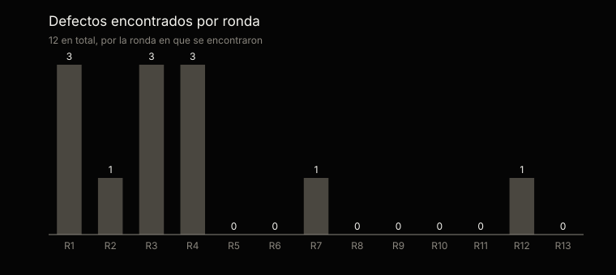

# Análisis estadístico de las pruebas · familia CFO

Generado por `scripts/analisis_familias.py` desde `tests/evidencias/familias/cfo/` · ronda más reciente: 14 · [English](ANALISIS.md)

No se edita a mano: cada cifra sale de la evidencia y el análisis se regenera con cada ronda.

## En una mirada

La ronda más reciente, la 14, parcial, sobre 1 de las 37 entidades del material: 9 de 9 señales sembradas encontradas (margen del 95 %: 70–100 %) y 0 de más; 8 de 8 datos extraídos bien (100 %, margen del 95 %: 67,5–100 %); y 0 de 0 entidades de control sin ninguna señal.

Sumando las rondas 1–14, 419 de 419 señales encontradas, 0 de más y 999 de 1001 datos bien. Las rondas repiten el mismo material: no son muestras independientes, y el margen se calcula sobre los casos de cada una.

## Qué se probó y cómo

En cada entidad corren el setup y el procesamiento de Clara, Tomás y Áurea —los comandos que procesan los documentos y escriben las fichas—, con un tope de tokens fijado antes de empezar, sobre un material que trae su clave aparte, que nadie ve. Los demás comandos calculan sobre esas fichas con el motor, que se prueba con cada cambio del repositorio. Las señales se comparan por su nombre y su clave; la extracción, campo por campo, contra lo que traen los documentos escritos. Las entidades de control no tienen ningún defecto sembrado: cualquier señal en ellas es una falla.

Cobertura: de las señales sembradas, cuántas encontró. Precisión: de las que levantó, cuántas eran correctas. Margen del 95 %: intervalo de confianza de Wilson sobre los casos.

|   |   |
|---|---|
| Rondas | 14; la más reciente, la 14, es parcial |
| Material | Retail · México |
| Entidades de control |  |
| Corridas de una entidad | 49 |
| Señales sembradas | 419 |
| Datos calificados | 1001 |

## Resultados acumulados · rondas 1–14

| Métrica | Casos | Resultado | Margen del 95 % |
|---|---|---|---|
| Señales · cobertura | 419 de 419 | 100 % | 99–100 % |
| Señales · precisión | 419 de 419 | 100 % | 99–100 % |
| Extracción · datos correctos | 999 de 1001 | 99,8 % | 99,2–100 % |
| Control · sin ninguna señal | 16 de 16 | 100 % | 80,6–100 % |

## Evolución por ronda

Una ronda que no corre todas las entidades es parcial: la primera, pequeña, antes de la completa, o una de verificación, que repite las corridas que un defecto corregido dejó pendientes.

| Ronda | Entidades | Señales · cobertura | Señales · precisión | Extracción | Control sin señales | Tokens | Defectos |
|---|---|---|---|---|---|---|---|
| 1 | 2 | 100 % | 100 % | 100 % | 1 de 1 | 17,3 M | 3 |
| 2 | 6 | 100 % | 100 % | 98 % | 2 de 2 | 53 M | 1 |
| 3 | 4 | 100 % | 100 % | 100 % | 1 de 1 | 17,2 M | 3 |
| 4 | 9 | 100 % | 100 % | 100 % | 3 de 3 | 38 M | 3 |
| 5 | 3 | 100 % | 100 % | 100 % | 1 de 1 | 12,7 M | 0 |
| 6 | 3 | 100 % | 100 % | 100 % | 1 de 1 | 13,2 M | 0 |
| 7 | 3 | 100 % | 100 % | 96 % | 1 de 1 | 12,1 M | 1 |
| 8 | 3 | 100 % | 100 % | 100 % | 1 de 1 | 12,3 M | 0 |
| 9 | 3 | 100 % | 100 % | 100 % | 1 de 1 | 12,8 M | 0 |
| 10 | 3 | 100 % | 100 % | 100 % | 1 de 1 | 12,7 M | 0 |
| 11 | 3 | 100 % | 100 % | 100 % | 1 de 1 | 11,9 M | 0 |
| 12 | 3 | 100 % | 100 % | 100 % | 1 de 1 | 14,4 M | 1 |
| 13 | 3 | 100 % | 100 % | 100 % | 1 de 1 | 12,1 M | 0 |
| 14 | 1 | 100 % | 100 % | 100 % | 0 de 0 | 10,8 M | 0 |

## La ronda más reciente · ronda 14

| Métrica | Casos | Resultado | Margen del 95 % |
|---|---|---|---|
| Señales · cobertura | 9 de 9 | 100 % | 70–100 % |
| Señales · precisión | 9 de 9 | 100 % | 70–100 % |
| Extracción · datos correctos | 8 de 8 | 100 % | 67,5–100 % |
| Control · sin ninguna señal | 0 de 0 | — | — |

## Por industria y país · ronda 14

| Material | Agentes | Señales | De más | Extracción | Tokens |
|---|---|---|---|---|---|
| Retail · México | Áurea, Clara, Tomás | 9 de 9 | 0 | 8 de 8 | 10,8 M |

## Lo que falló, uno por uno · rondas 1–14

2 fallas en 49 corridas, cada una con el defecto que la explica: su origen dice si falló el agente o la prueba. Las cifras son las de la calificación original: 1 de esas fallas vino de la prueba —el arnés o la clave—, no del agente, y con la prueba corregida se califican como correctas.

| Ronda | Material | Qué | Dónde | Defecto | Origen |
|---|---|---|---|---|---|
| 2 | Minería · Ecuador | Dato calificado como mal | presupuesto · committee_commitments | CFO-4 | Arnés de pruebas |
| 7 | Control · Brasil | Dato calificado como mal | cierre · declared.status | — | — |

## Defectos

12 defectos registrados, cada uno con su origen, su corrección y la corrida que la verificó: 12 verificados y 0 por verificar. 6 vinieron del material, la clave o el arnés de pruebas, no de los agentes.

| Origen | Defectos |
|---|---|
| Instrucciones del agente | 4 |
| Material de prueba | 3 |
| Arnés de pruebas | 2 |
| Código | 2 |
| Clave de calificación | 1 |

| Agente | Defectos |
|---|---|
| Tomás | 6 |
| Clara | 5 |
| Áurea | 2 |
| Ninguno | 1 |

## Consumo y próximo paso

Las 14 rondas usaron 261,1 millones de tokens: 250,3 millones en las corridas calificadas y 10,7 en las que se repitieron después de corregir un defecto. En promedio, 5,1 millones por entidad.

El material es sintético. Si una versión es estable o de laboratorio lo dice esta evidencia, no su número: estable, con el piso del margen del 95 % en 95 % o más en señales y en datos sobre la corrida más reciente de cada entidad, y ninguna señal en los controles (decisión 0020).

---

La evidencia completa de cada ronda: [`tests/evidencias/familias/cfo/`](https://github.com/josenanez/criterio/tree/main/tests/evidencias/familias/cfo).
