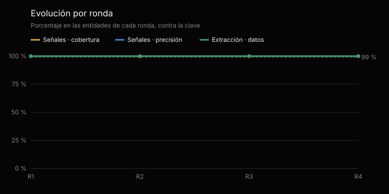
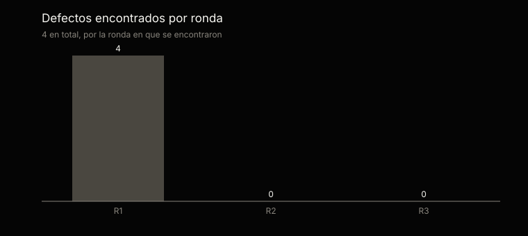

# Análisis estadístico de las pruebas · familia CISO

Generado por `scripts/analisis_familias.py` desde `tests/evidencias/familias/ciso/` · ronda más reciente: 4 · [English](ANALISIS.md)

No se edita a mano: cada cifra sale de la evidencia y el análisis se regenera con cada ronda.

## En una mirada

La ronda más reciente, la 4, parcial, sobre 1 de las 11 entidades del material: 26 de 26 señales sembradas encontradas (margen del 95 %: 87,1–100 %) y 0 de más; 8 de 8 datos extraídos bien (100 %, margen del 95 %: 67,5–100 %); y 0 de 0 entidades de control sin ninguna señal.

Sumando las rondas 1–4, 199 de 199 señales encontradas, 0 de más y 96 de 96 datos bien. Las rondas repiten el mismo material: no son muestras independientes, y el margen se calcula sobre los casos de cada una.

## Qué se probó y cómo

En cada entidad corren el setup y el procesamiento de Alexis, Guillermo y Amparo —los comandos que procesan los documentos y escriben las fichas—, con un tope de tokens fijado antes de empezar, sobre un material que trae su clave aparte, que nadie ve. Los demás comandos calculan sobre esas fichas con el motor, que se prueba con cada cambio del repositorio. Las señales se comparan por su nombre y su clave; la extracción, campo por campo, contra lo que traen los documentos escritos. Las entidades de control no tienen ningún defecto sembrado: cualquier señal en ellas es una falla.

Cobertura: de las señales sembradas, cuántas encontró. Precisión: de las que levantó, cuántas eran correctas. Margen del 95 %: intervalo de confianza de Wilson sobre los casos.

|   |   |
|---|---|
| Rondas | 4; la más reciente, la 4, es parcial |
| Material | Banca · Brasil |
| Entidades de control |  |
| Corridas de una entidad | 12 |
| Señales sembradas | 199 |
| Datos calificados | 96 |

## Resultados acumulados · rondas 1–4

| Métrica | Casos | Resultado | Margen del 95 % |
|---|---|---|---|
| Señales · cobertura | 199 de 199 | 100 % | 98,1–100 % |
| Señales · precisión | 199 de 199 | 100 % | 98,1–100 % |
| Extracción · datos correctos | 96 de 96 | 100 % | 96,1–100 % |
| Control · sin ninguna señal | 4 de 4 | 100 % | 51–100 % |

## Evolución por ronda

Una ronda que no corre todas las entidades es parcial: la primera, pequeña, antes de la completa, o una de verificación, que repite las corridas que un defecto corregido dejó pendientes.

| Ronda | Entidades | Señales · cobertura | Señales · precisión | Extracción | Control sin señales | Tokens | Defectos |
|---|---|---|---|---|---|---|---|
| 1 | 6 | 100 % | 100 % | 100 % | 2 de 2 | 31,9 M | 4 |
| 2 | 4 | 100 % | 100 % | 100 % | 2 de 2 | 20,1 M | 0 |
| 3 | 1 | 100 % | 100 % | 100 % | 0 de 0 | 11,4 M | 0 |
| 4 | 1 | 100 % | 100 % | 100 % | 0 de 0 | 11,2 M | 0 |

## La ronda más reciente · ronda 4

| Métrica | Casos | Resultado | Margen del 95 % |
|---|---|---|---|
| Señales · cobertura | 26 de 26 | 100 % | 87,1–100 % |
| Señales · precisión | 26 de 26 | 100 % | 87,1–100 % |
| Extracción · datos correctos | 8 de 8 | 100 % | 67,5–100 % |
| Control · sin ninguna señal | 0 de 0 | — | — |

## Por industria y país · ronda 4

| Material | Agentes | Señales | De más | Extracción | Tokens |
|---|---|---|---|---|---|
| Banca · Brasil | Alexis, Amparo, Guillermo | 26 de 26 | 0 | 8 de 8 | 11,2 M |

## Lo que falló, uno por uno · rondas 1–4

Ninguna falla.

| Ronda | Material | Qué | Dónde | Defecto | Origen |
|---|---|---|---|---|---|

## Defectos

4 defectos registrados, cada uno con su origen, su corrección y la corrida que la verificó: 4 verificados y 0 por verificar. 1 vinieron del material, la clave o el arnés de pruebas, no de los agentes.

| Origen | Defectos |
|---|---|
| Código | 2 |
| Arnés de pruebas | 1 |
| Instrucciones del agente | 1 |

| Agente | Defectos |
|---|---|
| Amparo | 2 |
| Alexis | 2 |
| Guillermo | 2 |

## Consumo y próximo paso

Las 4 rondas usaron 74,7 millones de tokens: 74,7 millones en las corridas calificadas y 0 en las que se repitieron después de corregir un defecto. En promedio, 6,2 millones por entidad.

El material es sintético. Si una versión es estable o de laboratorio lo dice esta evidencia, no su número: estable, con el piso del margen del 95 % en 95 % o más en señales y en datos sobre la corrida más reciente de cada entidad, y ninguna señal en los controles (decisión 0020).

---

La evidencia completa de cada ronda: [`tests/evidencias/familias/ciso/`](https://github.com/josenanez/criterio/tree/main/tests/evidencias/familias/ciso).
