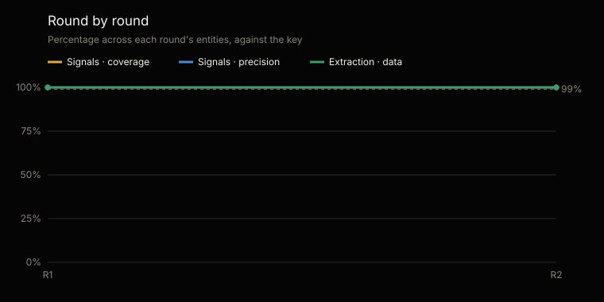
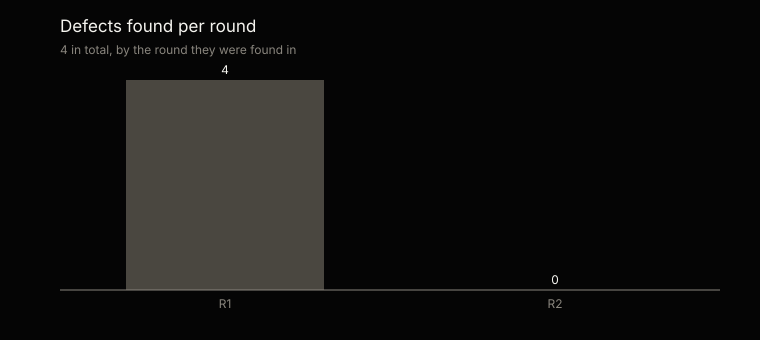

# Statistical analysis of the tests · CISO family

Generated by `scripts/analisis_familias.py` from `tests/evidencias/familias/ciso/` · most recent round: 2 · [Español](ANALISIS.es.md)

Not edited by hand: every figure comes from the evidence and the analysis is regenerated with every round.

## At a glance

The most recent round, round 2, partial, on 4 of the material's 10 entities: 48 of 48 seeded signals found (95% margin: 92.5–100%) and 0 extra; 32 of 32 data items extracted right (100%, 95% margin: 89.2–100%); and 2 of 2 control entities with no signal at all.

Across rounds 1–2, 148 of 148 signals found, 0 extra and 80 of 80 data items right. The rounds repeat the same material: they are not independent samples, and the margin is computed over each round's cases.

## What was tested and how

On each entity, Alexis, Guillermo and Amparo run their setup and processing —the commands that process the documents and write the records—, with a token cap set before starting, on material whose key is kept apart and never seen. The other commands calculate on those records with the engine, which is tested on every change to the repository. Signals are compared by name and key; extraction, field by field, against what the written documents say. Control entities carry no seeded defect: any signal in them is a failure.

Coverage: of the seeded signals, how many were found. Precision: of those raised, how many were right. 95% margin: Wilson confidence interval over the cases.

|   |   |
|---|---|
| Rounds | 2; the most recent, round 2, is partial |
| Material | energia · Peru, seguros · Chile |
| Control entities | Control · Chile, Control · Peru |
| Entity runs | 10 |
| Seeded signals | 148 |
| Data items graded | 80 |

## Cumulative results · rounds 1–2

| Measure | Cases | Result | 95% margin |
|---|---|---|---|
| Signals · coverage | 148 of 148 | 100% | 97.4–100% |
| Signals · precision | 148 of 148 | 100% | 97.4–100% |
| Extraction · data right | 80 of 80 | 100% | 95.4–100% |
| Control · with no signal | 4 of 4 | 100% | 51–100% |

## Round by round

A round that does not run every entity is partial: the first, small one, before the complete one, or a verification round, which repeats the runs a fixed defect left pending.

| Round | Entities | Signals · coverage | Signals · precision | Extraction | Control with no signal | Tokens | Defects |
|---|---|---|---|---|---|---|---|
| 1 | 6 | 100% | 100% | 100% | 2 of 2 | 31.9 M | 4 |
| 2 | 4 | 100% | 100% | 100% | 2 of 2 | 20.1 M | 0 |

## The most recent round · round 2

| Measure | Cases | Result | 95% margin |
|---|---|---|---|
| Signals · coverage | 48 of 48 | 100% | 92.5–100% |
| Signals · precision | 48 of 48 | 100% | 92.5–100% |
| Extraction · data right | 32 of 32 | 100% | 89.2–100% |
| Control · with no signal | 2 of 2 | 100% | 34.2–100% |

## By industry and country · round 2

| Material | Agents | Signals | Extra | Extraction | Tokens |
|---|---|---|---|---|---|
| energia · Peru | Alexis, Amparo, Guillermo | 25 of 25 | 0 | 8 of 8 | 5 M |
| seguros · Chile | Alexis, Amparo, Guillermo | 23 of 23 | 0 | 8 of 8 | 5.4 M |
| Control · Chile | Alexis, Amparo, Guillermo | 0 of 0 | 0 | 8 of 8 | 4.5 M |
| Control · Peru | Alexis, Amparo, Guillermo | 0 of 0 | 0 | 8 of 8 | 5.2 M |

## What failed, one by one · rounds 1–2

No failures.

| Round | Material | What | Where | Defect | Origin |
|---|---|---|---|---|---|

## Defects

4 defects logged, each with its origin, its fix and the run that verified it: 4 verified and 0 to verify. 1 came from the material, the key or the test harness, not from the agents.

| Origin | Defects |
|---|---|
| Code | 2 |
| Test harness | 1 |
| Agent instructions | 1 |

| Agent | Defects |
|---|---|
| Amparo | 2 |
| Alexis | 2 |
| Guillermo | 2 |

## Cost and next step

The 2 rounds used 52.1 million tokens: 52.1 million in the graded runs and 0 in the ones repeated after fixing a defect. On average, 5.2 million per entity.

The material is synthetic. Whether a version is stable or laboratory is said by this evidence, not its number: stable, with the floor of the 95% margin at 95% or more for signals and data over each entity's most recent run, and no signal in the controls (decision 0020).

---

The full evidence of every round: [`tests/evidencias/familias/ciso/`](https://github.com/josenanez/criterio/tree/main/tests/evidencias/familias/ciso).
