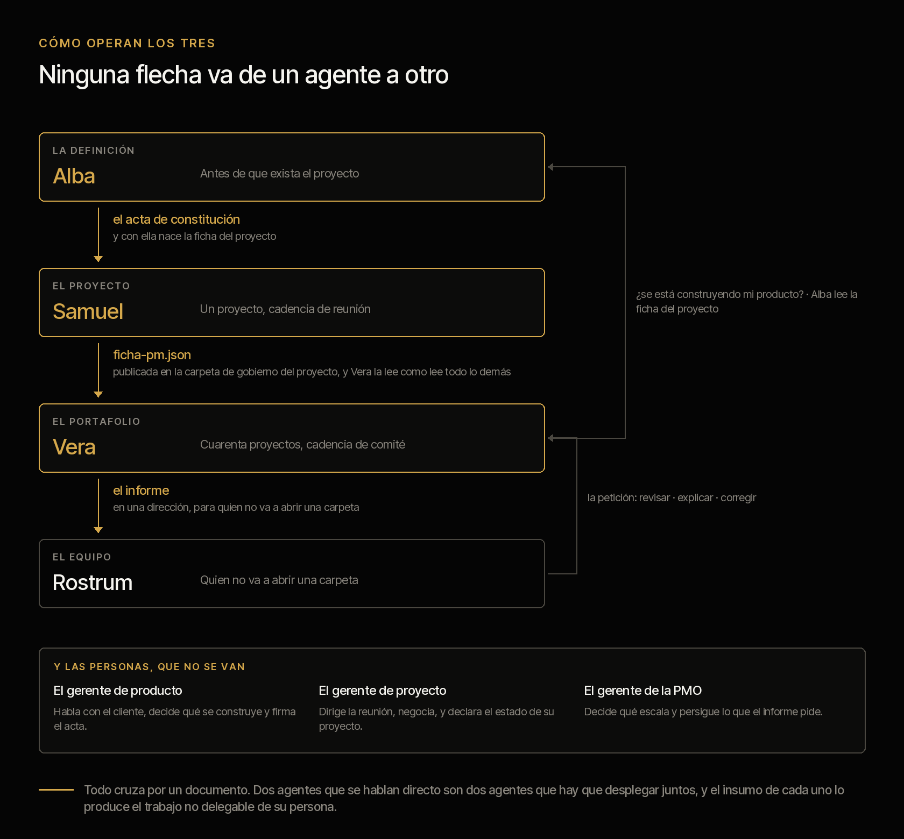

# La familia PMO

**Qué hace cada agente, cómo operan los tres juntos, cómo se comporta cada uno y cómo se
trabaja con él.** Esta es la página de la familia: lo que un director necesita antes de decidir
si esto entra en su organización, y lo que un gerente necesita antes de instalarlo.

[English](FAMILIA.md) · La promesa pública, con las cifras de terceros, está en el
[README del market](../../README.es.md); el inventario de comandos y skills de cada plugin, en
su propio README.

La hoja de diseño de cada agente —las tres clases de función, lo que falta por construir, las
decisiones cerradas y las abiertas— viaja con su plugin y está en castellano, porque su uso es
discutirla:

- [**Vera** · agente PMO](DISENO.es.md) — gobierno de portafolio
- [**Samuel** · agente Project Manager](../criterio-pm/DISENO.es.md) — un proyecto
- [**Alba** · agente Product Manager](../criterio-product/DISENO.es.md) — antes de que exista el proyecto

La forma de todo lo que estos agentes entregan —informes, proyección, piezas gráficas— está en
[`docs/design.md`](../../docs/design.md): es el diseño del portal, y se mantiene igual aquí.

---

## Qué hace cada agente

Tres agentes y un servidor. Cada funcionalidad con el comando que la entrega: si no tiene
comando, no existe, y esta tabla no promete nada que no se pueda correr.

### Vera · el agente de la PMO — `criterio-pmo`

| Funcionalidad | Comando |
|---|---|
| Dejar el agente listo sobre tus propias carpetas, en quince minutos | `/pmo-setup` |
| Leer la documentación y producir una ficha por proyecto, con cita de cada dato | `/portfolio-scan` |
| Decir qué documentos cambiaron de verdad y qué citas dejaron de resolver | `/document-index` |
| El informe consolidado: qué cambió, qué se contradice, qué está en silencio | `/portfolio-report` |
| El estado de un proyecto separando lo declarado de lo que sustentan los documentos | `/status-report` |
| Diagnosticar un proyecto desde cero, sin creerle a su informe de avance | `/health-check` |
| Reconstruir qué pasó, y cuándo la evidencia dejó de sostener lo reportado | `/project-history` |
| El registro de riesgos, supuestos, incidencias y dependencias — incluidos los dichos y nunca registrados | `/raid-log` |
| Las cuatro cifras del presupuesto y el disponible real | `/budget-tracking` |
| Evaluar un cambio y dejar la línea base nueva sin borrar la anterior | `/change-control` |
| Contrastar lo contratado contra lo recibido contra lo facturado | `/vendor-tracking` |
| Revisar o redactar el acta de constitución, y qué consecuencia tiene lo que falte | `/project-charter` |
| Cerrar contra el criterio de éxito pactado, con lecciones sustentables | `/project-closure` |
| El material de comité: un paquete de decisiones, no un informe de avance | `/steering-pack` |
| El estado de un producto a través de todos los proyectos que lo construyen | `/product-view` |
| Publicar el informe donde el equipo lo lea, sin instalar nada | `/pmo-server` |
| **Despertarse solo** y hacer lo que toque según la cadencia | `/pmo-wake` |

### Samuel · el agente del gerente de proyecto — `criterio-pm`

| Funcionalidad | Comando |
|---|---|
| Dejar el agente listo sobre tu proyecto, en diez minutos, leyendo tu última minuta | `/pm-setup` |
| **Quién prometió qué y para cuándo**, con la cita de la reunión donde se dijo | `/pm-commitments` |
| Lo vencido sin evidencia, y lo que se viene reprogramando reunión tras reunión | `/pm-commitments` |
| La agenda con los puntos que necesitan a alguien en la sala, y lo que esa sala no puede mover | `/pm-agenda` |
| El acta, separando compromiso, decisión, intención sin doliente y riesgo dicho al pasar | `/pm-minutes` |
| El informe semanal completo **salvo el estado**, que lo declaras tú | `/pm-report` |
| Publicar tu ficha donde la PMO la pueda leer | `/pm-publish` |
| El primer borrador del plan y la WBS, **sin comprometer ninguna fecha** | `/pm-plan` |
| Lo que excede tu autoridad como pregunta cerrada, con a quién alcanza **calculado** | `/pm-escalate` |
| **Despertarse solo** alrededor de tu reunión: la agenda antes, el acta después | `/pm-wake` |

### Alba · el agente del gerente de producto — `criterio-product`

| Funcionalidad | Comando |
|---|---|
| Dejar el agente listo y contrastar la definición que ya tengas escrita, en diez minutos | `/product-setup` |
| Entrevistas y tickets en temas **con la cita de quién lo dijo** | `/product-discovery` |
| El tema que lleva meses dicho y nadie ha convertido en nada | `/product-discovery` |
| El registro de requerimientos con sus vacíos: sin doliente, sin criterio, sin evidencia | `/product-requirements` |
| **La definición contra la evidencia de demanda**, y qué no está dicho en ninguna parte | `/product-definition` |
| Dónde el negocio declara un número y la métrica mide otro, con las dos fuentes | `/product-definition` |
| Lo decidido que nadie está construyendo, y el proyecto cuya ficha dice otro producto | `/product-trace` |
| El borrador de especificación con criterios verificables y los vacíos **señalados, no rellenados** | `/product-spec` |
| El acta de constitución con la que nace la ficha del proyecto | `/product-charter` |
| La estructura del caso de negocio con cada cifra citada, y los vacíos con quién los produce | `/product-business-case` |
| Publicar tu ficha donde los demás productos la puedan leer | `/product-publish` |
| **La misma métrica en dos casos de negocio**, el mismo proyecto con dos dueños, el mismo segmento | `/product-overlap` |
| **Despertarse solo** y decir qué cruzó un umbral sin que nadie hiciera nada | `/product-wake` |

### Rostrum · el servidor — dentro de `criterio-pmo`

| Funcionalidad | Cómo |
|---|---|
| Publicar el informe del portafolio en una dirección que el equipo abra | `/pmo-server` |
| Navegación por informes de PMO, proyectos y productos, con el enlace entre los dos | el portal |
| Recibir una petición —*revisar, explicar, corregir*— y dejarla en la cola de Vera | el portal |
| **No escribir nunca la ficha.** Es una restricción del código, verificada en cada corrida | por diseño |

---

## Cómo operan los tres



El orden temporal es lo que los hace un sistema y no tres herramientas:

```
    LA DEFINICIÓN            EL PROYECTO             EL PORTAFOLIO           EL EQUIPO
       Alba                     Samuel                    Vera                Rostrum
         │                         │                        │                     │
         │──── el acta ──────────► │                        │                     │
         │     nace la ficha       │                        │                     │
         │                         │──── ficha-pm.json ───► │                     │
         │                         │     publicada          │                     │
         │                         │                        │──── el informe ───► │
         │ ◄──── la ficha ─────────┴────────────────────────┘                     │
         │       ¿se está construyendo mi producto?                               │
         │                                                  │ ◄─── la petición ───┘
         │                                                  │   revisar · explicar · corregir
```

**Dos ciclos cerrados, y ninguno pasa por una base de datos compartida.** El acta baja una
vez, y con ella nace la ficha. La ficha del gerente sube publicada como un documento más del
proyecto, y Vera la lee como lee todo lo demás. El informe sale al equipo, y del equipo vuelve
una petición. Y el lazo de arriba: Alba lee las fichas de los proyectos para confirmar que el
que dice estar construyendo su producto de verdad lo esté.

Lo que **no** hay en ese dibujo es tan importante como lo que hay:

- **Ninguna flecha entre dos agentes.** Todas pasan por un documento. Dos agentes que se
  hablan directo son dos agentes que hay que desplegar juntos.
- **Ninguna flecha de vuelta desde Rostrum a la ficha.** El servidor no escribe.
- **Ninguna flecha que escriba el estado declarado.** Esa la escribe una persona, en los tres
  sitios donde aparece.

### Y las personas, en el mismo dibujo

```
   El gerente de producto      El gerente de proyecto      El gerente de la PMO
   decide qué se construye     declara el estado           decide qué escala
   y firma el acta             y dirige la reunión         y persigue lo que el informe pide
         │                              │                           │
         └──────── cada uno le da a su agente el insumo que ────────┘
                   ningún agente puede producir solo
```

**El insumo de cada agente lo produce el trabajo no delegable de su persona.** Quitar a la
persona no deja al agente solo: lo deja sin comida.

---

## Cómo se comporta cada uno, y cómo se trabaja con él

Los tres comparten cinco conductas. No son estilo: son las que hacen que el resultado se pueda
poner frente a un comité.

1. **Cada dato lleva la cita del documento de donde salió**, con su fecha. Un dato sin fuente
   es un defecto, no un caso degradado.
2. **«No está dicho en ninguna parte» es una respuesta válida**, y es la que más se usa al
   principio.
3. **Se callan cuando no hay nada.** Ninguno produce un informe para decir que no hay novedad.
4. **Ninguno declara.** Ninguno escribe el estado de un proyecto ni decide qué se construye.
5. **Ninguno le escribe a nadie.** Producen la lista; perseguir a alguien es una conversación.

Lo que cambia entre uno y otro es **el ritmo de la conversación**, y eso sí conviene saberlo
antes de instalarlos.

### Con Vera se conversa poco y se lee mucho

Vera trabaja sobre cuarenta carpetas. La conversación es corta —le dices qué proyecto, o
ninguno— y lo que devuelve es largo: un informe que alguien va a llevar a un comité.

**Cómo se trabaja con ella:** se corre `/pmo-setup` una vez, se le pone `/pmo-wake` a un
reloj, y después se le pregunta por excepción — *«diagnostica PRY-014 desde cero»*,
*«reconstruye qué pasó»*, *«arma el material del comité»*.

**Lo que te va a pedir a ti:** confirmar cinco campos por corrida, nunca cuarenta. Si preguntas
por cuarenta, no responde nadie. Y **actuar sobre lo que el informe pide**: si nadie actúa, el
informe siguiente dice lo mismo, y eso no es un defecto del agente.

**Lo que no le pidas:** que te diga en qué estado está un proyecto. Te dice qué declara su
gerente y qué sostienen los documentos, y **la diferencia entre las dos cosas es el producto.**

### Con Samuel se conversa todas las semanas

Samuel trabaja sobre un proyecto y su ciclo es la reunión. La conversación es frecuente y
corta, y casi siempre gira alrededor de un documento que acaba de aparecer.

**Cómo se trabaja con él:** `/pm-setup` una vez; después, el día antes de la reunión
`/pm-agenda`, el día después `/pm-minutes` con la transcripción o las notas, y una vez por
semana `/pm-report`.

**Lo que te va a pedir a ti:** la minuta. Es su insumo principal y sin ella se seca — un
gerente que no guarda lo que la reunión deja escrito necesita saberlo el primer día, y
`/pm-setup` se lo dice. Y **la declaración del estado**, que te pide siempre **después** de
mostrarte la evidencia y nunca antes: si te propusiera un estado, tu declaración dejaría de ser
información independiente.

**Lo que no le pidas:** que persiga un compromiso vencido. Te da el nombre, la fecha y la cita;
la llamada la haces tú, porque perseguir es una conversación.

### Con Alba se conversa por temporadas

Alba trabaja antes de que exista el proyecto, y ese trabajo no es semanal: viene por rachas
—una ronda de entrevistas, un comité de producto, una definición que hay que cerrar— con
semanas tranquilas en medio.

**Cómo se trabaja con ella:** `/product-setup` una vez; `/product-discovery` cada vez que
termina una ronda de entrevistas; `/product-definition` cuando la definición se va a cerrar o
cuando alguien la va a discutir; `/product-charter` el día que se vuelve proyecto.

**Lo que te va a pedir a ti:** hablar con el cliente. Es la parte del oficio que ningún agente
va a tener, y sin ella no hay nada que sintetizar. Y **decidir**: lo que lleva sesenta días sin
decidirse sigue sin decidirse cuando Alba termina; lo que cambia es que ahora tiene nombre,
días y alguien a quien preguntarle.

**Lo que no le pidas:** que te diga si algo va a gustar. Eso no está en ningún documento.

### Con Rostrum no se conversa

Es un servidor. Se levanta con `/pmo-server`, se abre una dirección, y ahí está el informe para
quien no va a abrir una carpeta. Lo único que devuelve hacia adentro es una petición que
alguien dejó, y esa la atiende Vera en su próxima corrida.

---

## La necesidad común: proyectos

Los tres agentes existen alrededor de un mismo objeto, y la elección carga todo el peso del
diseño: **un proyecto tiene plan, y sin plan no hay contra qué comparar.**

Toda la propuesta se sostiene en contrastar lo que alguien declara contra lo que sustentan los
documentos. Esa comparación necesita una referencia aprobada. En un proceso o en un área no
existe el *contra qué*; en un proyecto sí, y se llama línea base.

---

## Los tres agentes y el único contrato

Nada se habla con nada directamente. **La ficha de proyecto es el único contrato.**

```
   archivos ─┐
             ├──► extracción ──► FICHA ──► cálculo ──► proyección ──► servidor
   base de   ┘                    ▲ ▲ ▲
   datos                          │ │ └── PMO      escribe hallazgos, lee todas
                                  │ └──── PM       escribe la ficha, lee la suya
                                  └────── Product  la crea, con el acta
```

El Product Manager trabaja antes de que exista plan: no escribe en la ficha, **la crea**. Su
entrega cierra con el acta de constitución, que es el certificado de nacimiento de la ficha.

Y el orden temporal es lo que hace de los tres un sistema:

```
Product Manager  ──acta──►  Project Manager  ──ficha──►  PMO
   define                      ejecuta                    vigila el conjunto
```

### Las siete invariantes

1. **Los agentes no se hablan entre sí.** Se hablan por la ficha.
2. **Rostrum, el servidor, no escribe.**
3. **La fuente puede cambiar; la ficha no.** Un adaptador nuevo llena los mismos campos.
4. **Declarado y evidenciado nunca se fusionan**, venga de archivo o de base de datos.
5. **El modelo extrae, el código calcula.**
6. **Ningún agente escribe la declaración.** El estado declarado lo escribe una persona.
7. **Una ficha, un escritor.** Dos agentes que leen los mismos documentos escriben dos
   fichas, y no se fusionan nunca. La diferencia entre las dos es el hallazgo.

La sexta es la más fácil de romper por conveniencia y la que se lleva el sistema entero si se
rompe: si el agente declara, la comparación entre declaración y evidencia compara al sistema
consigo mismo, y todo esto se vuelve un generador de informes bonitos. No es una recomendación
de la documentación: es una restricción del camino de escritura, y falla si se intenta.

La séptima es la cuarta un nivel más arriba, y aparece en cuanto hay más de un agente sobre
el mismo proyecto. La forma cómoda de resolverlo —una ficha y un dueño— obliga a elegir mal
en las dos direcciones: si manda el gerente, la PMO no puede leer por su cuenta cuando duda;
si manda la PMO, entra en el camino crítico de setenta proyectos. Dos fichas quitan el
problema en vez de arbitrarlo, y **lo que era un conflicto de escritura se vuelve la señal.**
Ver [Samuel · las dos fichas](../criterio-pm/DISENO.es.md#las-dos-fichas).

---

## Las tres clases

Cada función de cada rol cae en una de tres. **El alcance construido de Criterio es A y B.**

### A — Lo que el agente hace, y hoy consume tiempo de alguien

Trabajo que la organización ya ejecuta todas las semanas: leer, consolidar, cruzar, reportar.
El agente no lo acelera, lo sustituye. Se reconoce por una prueba simple: **si nadie lo hace,
alguien lo nota.**

### B — Lo que el agente hace y hoy no se hace

Trabajo que la organización no ejecuta, no por descuido sino porque costaría días por
proyecto: el forense de catorce meses, la contradicción entre cuarenta carpetas, el supuesto
que nadie verificó. Se reconoce por la prueba inversa: **si nadie lo hace, nadie lo nota.**

La distinción importa para entender el valor. La A ahorra tiempo en trabajo que ya se hace y la
agradece el equipo. La B produce lo que hoy no existe en ninguna PMO, y la compra un director.

### C — Lo que el agente no hace

Un conjunto de acciones que el agente **no ejecuta**. Nada más.

Esta lista no evalúa riesgos ni exposición de nadie: describe el límite del agente. Quien
instala Criterio acepta los [términos](../../TERMS.es.md) —la verificación es suya, §2; se
entrega sin garantía ni responsabilidad, §5— y el [descargo](../../DISCLAIMER.es.md). La
responsabilidad de uso y de ejecución es de la organización que lo despliega, y si en su
contexto la clase C es más grande que esta lista, delimitarla y documentarla le corresponde a
ella, con el descargo adicional que su gobierno interno exija.

Cada fila de C lleva dos datos, y ninguno es un riesgo:

- **Requiere** — por qué está fuera del alcance del agente: *autoridad* (compromete a la
  organización), *información fuera de los documentos*, o *juicio sobre personas*.
- **Qué le entrega al agente** — porque casi toda función de C produce el insumo de una función
  de A o de B. Es la parte que hace de esto un ciclo y no dos mundos separados.

---

## Cómo se llaman

**La capacidad se llama PMO, CFO o CLO. El agente lleva nombre de persona.** Son dos cosas
distintas y conviene no mezclarlas: la capacidad es la función de la organización, y el
agente es quien la extiende.

Que lleven nombre de persona no es un adorno: **son capacidades extendidas de personas
reales**, y el producto entero se sostiene en que la persona sigue ahí. Un nombre propio
dice eso sin tener que explicarlo.

| Pieza | Nombre | De dónde viene | La frase |
|---|---|---|---|
| Agente PMO | **Vera** | latín *verus*, lo verdadero | *Vera dice lo que los documentos dicen, no lo que se reporta* |
| Agente Project Manager | **Samuel** | «el que escuchó» | *Samuel oyó lo que se dijo en la reunión, y lo recuerda el viernes* |
| Agente Product Manager | **Alba** | el amanecer, antes de que haya luz | *Alba trabaja antes de que el proyecto exista* |
| El servidor | **Rostrum** | una tribuna | *Sostiene lo que ya está escrito, donde otros puedan leerlo* |

**La regla, que es lo que hace que esto escale y no la lista:** el nombre de un agente es
un nombre de persona **cuyo significado apunta al oficio que su familia extiende**, y tiene
que poder terminar la frase «X hace esto, y no opina». Si no la termina, está mal elegido.

Samuel es el que mejor lo muestra: la función central de ese agente es **el compromiso
dicho y no cumplido**, y el nombre significa literalmente «el que escuchó».

Las familias que vengan eligen con la misma regla y con las referencias de su propio
gremio — **CFO** con Mateo, patrono de contadores y banqueros, o Luca por Pacioli; **CLO**
con Ivo, patrono de los abogados. Quien pertenece al gremio reconoce la referencia sin que
nadie se la explique, y quien no la reconoce solo ve un nombre, que también está bien.

**El servidor es el único que no lleva nombre de persona, y es a propósito.** Los agentes
lo llevan porque toman decisiones sobre lo que leen; el servidor no toma ninguna. Es
infraestructura, y conserva nombre de objeto: una tribuna no mide, no corrige y no opina —
sostiene lo que ya está escrito a la altura de quien lo va a leer. Si algún día calculara
algo, el nombre dejaría de ser cierto, y eso es exactamente lo que se quiere que se note.

**Los nombres no se traducen** —son propios— y **no son identificadores**: el plugin se
sigue llamando `criterio-pmo`, los comandos y los skills no cambian. El nombre le da
carácter a lo que la persona ve, no a lo que el código importa.

---

## Un dueño por cosa

No se duplica documentación. Una tabla copiada en tres documentos se desactualiza en el
primero que nadie mire, y eso ya pasó: la lista de señales de la página pública llegó a estar
cinco señales atrás y a prometer una que el código no emitía.

| Cosa | Dueño | Por qué ahí |
|---|---|---|
| Los valores de los umbrales | `DEFAULT_THRESHOLDS` en `scripts/pmo.py` | Es lo que el código lee. Cualquier otra copia es una opinión |
| Qué significa cada señal y cuándo merece alarma | el skill `portfolio-health` | Es lo que el modelo carga en tiempo de ejecución, y tiene que sostenerse solo |
| El inventario de comandos y skills | el README del plugin | El plugin se distribuye por el market y su README viaja con él |
| La promesa pública y las cifras de terceros | el README del market | Es la primera página que alguien abre, y la única que decide una instalación |
| El diseño de cada agente | estas hojas | Clases, flujo, lo que es de las personas, lo que falta |
| El resultado de las corridas | `tests/<plugin>/EVIDENCIA.md` | La evidencia vive con el material que la produjo |

Lo verifican dos cosas, y ninguna es un humano acordándose: `scripts/validate_plugins.py`
exige que el README del plugin liste cada comando, y `tests/coherencia.py` exige que cada
señal que el código calcula esté documentada en su skill y que cada comando aparezca en la
página pública. **Si algo se agrega y no se documenta en su dueño, falla.**

---

## Lo que sigue siendo de las personas

Los tres roles siguen existiendo completos. Esto extiende capacidad; no sustituye función. Y el
argumento no es de cortesía, es estructural:

> **El insumo de cada agente lo produce el trabajo no delegable de su persona.**

El agente PM necesita que alguien dirija la reunión, porque de ahí sale la minuta que lo
alimenta. El agente PMO necesita que alguien persiga lo que el informe pide, porque si nadie
actúa el informe siguiente dice lo mismo. El agente de producto necesita que alguien hable con
el cliente, porque no hay síntesis sin entrevista.

Quitar a la persona no deja al agente solo: lo deja sin comida. Cada hoja documenta qué se
rompe primero si se intenta, y en qué orden.

---

## Estado

**Los tres están construidos y se pueden instalar hoy**, y los tres tienen la misma deuda,
que conviene no esconder: **verificados sobre corpus sintético, no probados sobre la
documentación real de una organización.**

| Agente | Se instala | Sus tablas A y B |
|---|---|---|
| Vera · PMO | `criterio-pmo` · 17 comandos, 10 skills | **Sin filas abiertas** |
| Samuel · Project Manager | `criterio-pm` · 9 comandos, 8 skills | **Sin filas abiertas** |
| Alba · Product Manager | `criterio-product` · 11 comandos, 12 skills | **Sin filas abiertas** |
| Rostrum · el servidor | Dentro de `criterio-pmo` | — |

**Ninguna de las tres hojas de diseño tiene ya una fila en «Falta» o en «Parcial».** Lo que
sigue pendiente no es construcción.

Y una deuda que es de los tres a la vez: **la extracción nunca se ha corrido.** Los tres
corpus siembran el estado desde sus respuestas de referencia, así que la cadena documento →
modelo → ficha no se ha ejercitado.

La corrida que sostiene estos estados, con lo que prueba y lo que no, está en las tres
páginas de evidencia bajo [`tests/`](../../tests/) y, dibujada, en
[`docs/pruebas.html`](../../docs/pruebas.html). La quinta decisión de la tabla siguiente salió de
ahí y no de una conversación.

---

## Cómo se configura y cada cuánto corre cada uno

Esta es la tabla que responde tres preguntas a la vez: **dónde se ve cada agente, qué le
hace falta configurado, y cada cuánto tiene sentido que corra.**

| | Vera | Samuel | Alba |
|---|---|---|---|
| **Se instala** | `criterio-pmo` | `criterio-pm` | `criterio-product` |
| **Instancias** | Una por PMO | **Una por proyecto** | **Una por producto** |
| **Se configura con** | `/pmo-setup` | `/pm-setup` | `/product-setup` |
| **Cuánto tarda eso** | Quince minutos | Diez | Diez |
| **Qué le tienes que decir** | Dónde está la documentación, cuándo es el comité, quién eres | Dónde está tu proyecto, cuándo es tu reunión, quién eres | Dónde está la definición, quién decide qué se construye, quién eres |
| **Dónde queda** | Un archivo de la persona, escrito por el comando | Igual | Igual |
| **El que se le pone a un reloj** | `/pmo-wake` | `/pm-wake` | `/product-wake` |
| **Cadencia que tiene sentido** | Diaria si el barrido está activo; y el informe con su anticipación al comité | Diaria con barrido, o el día antes y el día después de la reunión | **Semanal alcanza** |
| **Qué lo despierta además del reloj** | Una petición que alguien dejó en Rostrum | Una minuta nueva en la carpeta | Que algo cruzara un umbral solo |

**Nadie edita un archivo de configuración a mano.** Es una regla de los tres comandos de
instalación, no una cortesía: si para cambiar un umbral hay que abrir un JSON, el umbral se
queda como vino y la configuración deja de describir a la organización. Se dice en la
conversación y el comando lo reescribe.

Cada plugin trae su `scripts/config.example.json` para ver la forma completa sin instalar
nada.

### Por qué las tres cadencias son distintas

No es una preferencia: **cada agente mide contra otra cosa.**

- **Vera** mide contra la carpeta. Un documento nuevo puede cambiar el estado de un
  proyecto hoy, así que el barrido diario tiene sentido y el informe se entrega con
  anticipación al comité — para que el gerente de la PMO alcance a reaccionar a lo que
  encuentre, no para que se entere cuando ya está enviado.
- **Samuel** mide contra la reunión. Su ciclo no es el calendario: es *antes de la reunión*
  y *después de la reunión*, y por eso `/pm-wake` mira de qué lado estás antes de ofrecer
  nada.
- **Alba** mide contra el paso del tiempo, y eso cambia todo. Sus umbrales se cuentan en
  meses, así que una corrida diaria sobre un registro que se mueve poco es ruido con
  puntualidad. **Pero es la única de los tres cuyos hallazgos aparecen sin que nadie haga
  nada**: el requerimiento que llevaba cincuenta y nueve días sin decidirse llega a
  sesenta, y nadie va a abrir una sesión para preguntar si eso ya pasó.

### Los tres se callan cuando no hay nada

Es la regla que decide si un agente sigue instalado el mes siguiente. Los tres comandos de
reloj devuelven `quiet` cuando no toca nada, y con `quiet` la salida es una línea: qué se
revisó y cuándo vuelve.

Un agente que produce un informe para decir que no hay novedad enseña a ignorarlo, y el día
que sí hay novedad ya nadie lo abre.

### Qué es lo que **no** está programado

Conviene decirlo aquí y no en una nota al pie: **ninguno de los tres se programa solo.**
Los tres traen el comando que un reloj invoca, y el reloj vive fuera del plugin — una tarea
programada de Claude Cowork, o el programador del sistema operativo invocando Claude en
modo no interactivo. Alguien tiene que ponerlo, una vez, y cada comando de reloj explica
cómo.

Y para que corra sin nadie delante hacen falta dos cosas que no dependen de este
repositorio: **que la sesión pueda correr sin aprobar cada paso**, y **que la carpeta esté
montada cuando el reloj dispare.**

**Si la organización no quiere corridas desatendidas** —y en un banco es una respuesta
razonable— los tres comandos sirven corridos a mano, y la cadencia sigue diciendo qué toca.
Lo que se pierde es que avisen sin que nadie pregunte, que es justamente lo que más cuesta
ver a mano.

---

## Decisiones de esquema, cerradas

Aquí vivían cinco, todas de esquema y todas por decidir **antes** de que un agente empezara a
llenar fichas: una ficha llena con el esquema equivocado es la migración que no queremos hacer.

**Las cinco se construyeron** —`source_kind`, `producto`, `autoridad`, el monto por entregable
y, la última, **`requerimiento` como registro**—, y por eso salen de la tabla en vez de quedarse
como historia. El registro de requerimiento es el contrato de datos de Alba, vive en
`criterio-product` con su propia aritmética, y es el que vuelve *«qué requerimientos faltan»* un
filtro en vez de una corrida de modelo sobre documentos cada vez. El esquema va en 0.2.

Lo que queda abierto de verdad está en cada hoja: **cómo bajan los estándares de la PMO a N
instalaciones** y **qué pasa cuando un gerente publica su ficha y no quiere** —las dos en la
hoja del Project Manager—, y **el análisis de canibalización**, que necesita las métricas de más
de un producto a la vista y hoy cada instalación mira el suyo.

Sobre la base de datos hay una trampa que conviene dejar escrita: **lo que trae un PPM son más
declaraciones, no evidencia.** El campo *"estado: verde"* de la herramienta corporativa es la
afirmación del gerente con otra interfaz. La evidencia sigue viviendo en actas y minutas.
