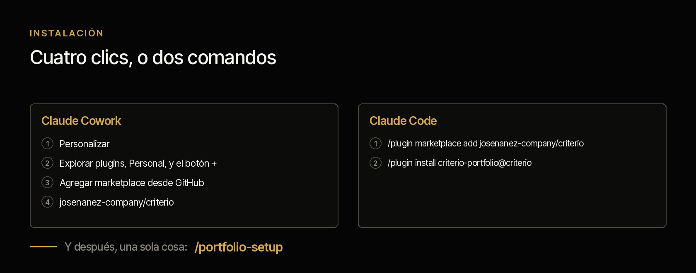
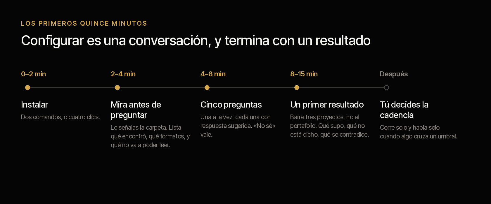
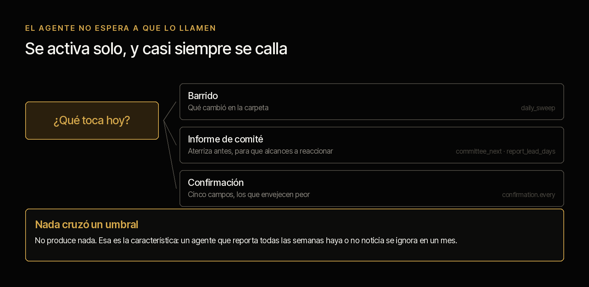
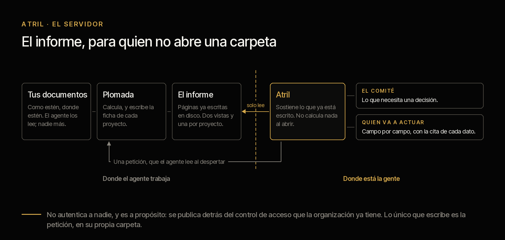
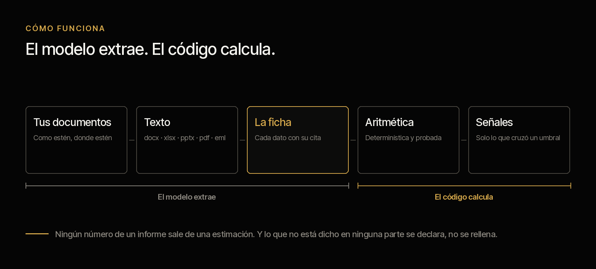

# criterio-pmo

**Vera, un segundo cerebro para la oficina de proyectos.** Lee la documentación que tu PMO ya
tiene y dice qué cambió, qué se contradice y qué lleva semanas en silencio.

[English](README.md) · Apache 2.0 · Se instala en cuatro clics · **El primer resultado sale
en quince minutos, sobre tus propios documentos**

---

## La familia PMO


La capacidad tiene más de un agente porque la organización tiene más de un rol. Llevan nombre
de persona porque **son capacidades extendidas de personas**, y el significado de cada
nombre apunta a lo que hace: **Vera** —de *verus*, lo verdadero— dice lo que los documentos
dicen y no lo que se reporta; **Samuel** —«el que escuchó»— recuerda el viernes lo que se
dijo en la reunión; **Alba** trabaja antes de que amanezca el proyecto.

**Los tres se instalan hoy**, cada uno con su propio plugin, y comparten el mismo contrato
de datos. Los tres tienen también la misma deuda, y está escrita en su página: construidos y
verificados sobre corpus sintético, **no probados todavía sobre la documentación real de una
organización.**

**Samuel**, el agente del gerente de proyecto, no va a las reuniones — el gerente va. Lo que hace es que el gerente llegue
con la semana preparada: la agenda armada antes, la minuta redactada después, el plan al día
contra la evidencia y el informe listo salvo una línea. Su función central no la hace ninguna
herramienta que un gerente use hoy: **el compromiso dicho y no cumplido.** Las reuniones están
llenas de *«yo lo tengo para el viernes»* y nadie los registra.

**Alba** trabaja antes de que exista el proyecto, y entrega el acta con la
que el proyecto nace.

---

## Cómo operan los tres


El orden temporal es lo que los hace un sistema y no tres herramientas. **Dos ciclos cerrados, y ninguno pasa por una base de datos compartida.** El acta baja una
vez, y con ella nace la ficha. La ficha del gerente sube publicada como un documento más del
proyecto, y Vera la lee como lee todo lo demás. El informe sale al equipo, y del equipo vuelve
una petición. Y el lazo de arriba: Alba lee las fichas de los proyectos para confirmar que el
que dice estar construyendo su producto de verdad lo esté.

Lo que **no** hay en ese dibujo es tan importante como lo que hay:

- **Ninguna flecha entre dos agentes.** Todas pasan por un documento. Dos agentes que se
  hablan directo son dos agentes que hay que desplegar juntos.
- **Ninguna flecha de vuelta desde Rostrum a la ficha.** El servidor no escribe.
- **Ninguna flecha que escriba el estado declarado.** Esa la escribe una persona, en los tres
  sitios donde aparece.

**Y las personas están en el mismo dibujo, abajo.** El insumo de cada agente lo produce el trabajo no delegable de su persona.** Quitar a la
persona no deja al agente solo: lo deja sin comida.

## Estado

**Los tres están construidos y se pueden instalar hoy**, y los tres tienen la misma deuda,
que conviene no esconder: **verificados sobre corpus sintético, no probados sobre la
documentación real de una organización.**

| Agente | Se instala | Su página | Sus pruebas | Tablas A y B |
|---|---|---|---|---|
| **Vera** · PMO | `criterio-pmo` · 17 comandos, 10 skills | esta | [resultados](../../tests/criterio-pmo/RESULTADOS.md) · [qué prueban](../../tests/criterio-pmo/EVIDENCIA.md) | **sin filas abiertas** |
| **Samuel** · proyecto | `criterio-pm` · 9 comandos, 8 skills | [ir](../criterio-pm/README.es.md) | [resultados](../../tests/criterio-pm/RESULTADOS.md) · [qué prueban](../../tests/criterio-pm/EVIDENCIA.md) | **sin filas abiertas** |
| **Alba** · producto | `criterio-product` · 11 comandos, 12 skills | [ir](../criterio-product/README.es.md) | [resultados](../../tests/criterio-product/RESULTADOS.md) · [qué prueban](../../tests/criterio-product/EVIDENCIA.md) | **sin filas abiertas** |
| **Rostrum** · el servidor | dentro de `criterio-pmo` | [SERVER.es.md](SERVER.es.md) | dentro de los de Vera | — |

**Cada agente tiene su análisis de pruebas en markdown**, generado desde la corrida: qué
puerta se corrió, qué prueba, cuántas comprobaciones, cuánto tardó, y —en el mismo archivo y
no en un anexo— **qué no cubre**. Se leen en GitHub sin descargar nada.

**Ninguna de las tres hojas de diseño tiene ya una fila en «Falta» o en «Parcial».** Lo que
sigue pendiente no es construcción.

Y una deuda que es de los tres a la vez: **la extracción nunca se ha corrido.** Los tres
corpus siembran el estado desde sus respuestas de referencia, así que la cadena documento →
modelo → ficha no se ha ejercitado.

La corrida que sostiene estos estados, con lo que prueba y lo que no, está en las tres
páginas de evidencia bajo [`tests/`](../../tests/) y el conjunto en
[`docs/pruebas.md`](../../docs/pruebas.md) — con gráficas, para el navegador, en
[`pruebas.html`](../../docs/pruebas.html). La quinta decisión de la tabla siguiente salió de
ahí y no de una conversación.

## Instalar



**Claude Code**

```
/plugin marketplace add josenanez-company/criterio
/plugin install criterio-pmo@criterio
/pmo-setup
```

## Los primeros quince minutos



No hay archivo de configuración que editar, ni plantilla que llenar, ni carpeta que ordenar
antes de empezar. La configuración **es una conversación**, y termina con un resultado sobre
tus documentos.

| | |
|---|---|
| **0 – 2 min** | **Instalar.** Dos comandos en Claude Code, o cuatro clics en Cowork |
| **2 – 4 min** | **Mira antes de preguntar.** Le señalas la carpeta donde vive la documentación de proyectos, como esté. Lista lo que encontró: cuántos proyectos distingue, cuántos documentos, qué formatos, cuál es el más reciente, y cuáles no va a poder leer. Ahí sabes que está mirando tus cosas de verdad |
| **4 – 8 min** | **Cinco preguntas.** Quién eres, cuándo se reúne tu comité, quién recibe el informe y en qué forma, y los términos. Una a la vez, cada una con una respuesta sugerida a partir de lo que ya vio. *«No sé»* es una respuesta válida |
| **8 – 15 min** | **Un primer resultado.** Barre **tres proyectos**, no el portafolio completo, para que veas algo real en minutos: qué supo de cada uno, qué no está dicho en ninguna parte, y cualquier contradicción o compromiso vencido que haya aparecido de paso |

Al final te dice cuánto tomaría el portafolio completo, y qué le falta a tu carpeta para que
el análisis sea mejor. Pero como hallazgo, no como requisito: **esto funciona con lo que
haya.**

---

## El agente no espera a que lo llamen



Esta es la diferencia entre un comando y un agente. Un comando espera. **Este se programa y
corre solo.**

De las cinco preguntas del arranque sale una cadencia, y de la cadencia sale qué toca cada
día. La decisión es aritmética de fechas, así que la toma el código y no el criterio del
momento:

```
python3 scripts/pmo.py due --state <estado> --config <archivo>
```

Y `/pmo-wake` es el comando que el reloj invoca: mira qué toca, lo hace, y **si no toca nada
no produce nada.** Callarse cuando no pasó nada no es una omisión — es la única razón por la
que un agente que corre todos los días sigue instalado el mes siguiente.

Tres cosas pueden tocar. El **barrido**, que mira qué cambió en la carpeta y solo recalcula
los proyectos tocados. El **informe de comité**, que aterriza con la anticipación que
configuraste para que alcances a reaccionar a lo que encuentre. Y la **confirmación**, cinco
campos por corrida — los que envejecen peor: patrocinador, gerente, presupuesto aprobado,
fecha de cierre y alcance.

Ponerlo en un reloj es del lado de tu organización: una tarea programada en Cowork, o el
programador del sistema en Claude Code. **Y si no quieren corridas desatendidas** —en un
banco es una respuesta razonable— la cadencia sigue diciendo qué toca, corrida a mano. Lo
que se pierde es que avise sin que nadie pregunte.

## Cómo se configura y cada cuánto corre cada uno

Esta es la tabla que responde tres preguntas a la vez: **dónde se ve cada agente, qué le
hace falta configurado, y cada cuánto tiene sentido que corra.**

| | Vera | Samuel | Alba |
|---|---|---|---|
| **Se instala** | `criterio-pmo` | `criterio-pm` | `criterio-product` |
| **Instancias** | Una por PMO | **Una por proyecto** | **Una por producto** |
| **Se configura con** | `/pmo-setup` | `/pm-setup` | `/product-setup` |
| **Cuánto tarda eso** | Quince minutos | Diez | Diez |
| **Qué le tienes que decir** | Dónde está la documentación, cuándo es el comité, quién eres | Dónde está tu proyecto, cuándo es tu reunión, quién eres | Dónde está la definición, quién decide qué se construye, quién eres |
| **Dónde queda** | Un archivo de la persona, escrito por el comando | Igual | Igual |
| **El que se le pone a un reloj** | `/pmo-wake` | `/pm-wake` | `/product-wake` |
| **Cadencia que tiene sentido** | Diaria si el barrido está activo; y el informe con su anticipación al comité | Diaria con barrido, o el día antes y el día después de la reunión | **Semanal alcanza** |
| **Qué lo despierta además del reloj** | Una petición que alguien dejó en Rostrum | Una minuta nueva en la carpeta | Que algo cruzara un umbral solo |

**Nadie edita un archivo de configuración a mano.** Es una regla de los tres comandos de
instalación, no una cortesía: si para cambiar un umbral hay que abrir un JSON, el umbral se
queda como vino y la configuración deja de describir a la organización. Se dice en la
conversación y el comando lo reescribe.

Cada plugin trae su `scripts/config.example.json` para ver la forma completa sin instalar
nada.

### Por qué las tres cadencias son distintas

No es una preferencia: **cada agente mide contra otra cosa.**

- **Vera** mide contra la carpeta. Un documento nuevo puede cambiar el estado de un
  proyecto hoy, así que el barrido diario tiene sentido y el informe se entrega con
  anticipación al comité — para que el gerente de la PMO alcance a reaccionar a lo que
  encuentre, no para que se entere cuando ya está enviado.
- **Samuel** mide contra la reunión. Su ciclo no es el calendario: es *antes de la reunión*
  y *después de la reunión*, y por eso `/pm-wake` mira de qué lado estás antes de ofrecer
  nada.
- **Alba** mide contra el paso del tiempo, y eso cambia todo. Sus umbrales se cuentan en
  meses, así que una corrida diaria sobre un registro que se mueve poco es ruido con
  puntualidad. **Pero es la única de los tres cuyos hallazgos aparecen sin que nadie haga
  nada**: el requerimiento que llevaba cincuenta y nueve días sin decidirse llega a
  sesenta, y nadie va a abrir una sesión para preguntar si eso ya pasó.

### Los tres se callan cuando no hay nada

Es la regla que decide si un agente sigue instalado el mes siguiente. Los tres comandos de
reloj devuelven `quiet` cuando no toca nada, y con `quiet` la salida es una línea: qué se
revisó y cuándo vuelve.

Un agente que produce un informe para decir que no hay novedad enseña a ignorarlo, y el día
que sí hay novedad ya nadie lo abre.

### Qué es lo que **no** está programado

Conviene decirlo aquí y no en una nota al pie: **ninguno de los tres se programa solo.**
Los tres traen el comando que un reloj invoca, y el reloj vive fuera del plugin — una tarea
programada de Claude Cowork, o el programador del sistema operativo invocando Claude en
modo no interactivo. Alguien tiene que ponerlo, una vez, y cada comando de reloj explica
cómo.

Y para que corra sin nadie delante hacen falta dos cosas que no dependen de este
repositorio: **que la sesión pueda correr sin aprobar cada paso**, y **que la carpeta esté
montada cuando el reloj dispare.**

**Si la organización no quiere corridas desatendidas** —y en un banco es una respuesta
razonable— los tres comandos sirven corridos a mano, y la cadencia sigue diciendo qué toca.
Lo que se pierde es que avisen sin que nadie pregunte, que es justamente lo que más cuesta
ver a mano.

## ¿Quieres que tu patrocinador vea esto sin pedírtelo?



Hasta aquí el informe son archivos en tu equipo. **Un patrocinador no abre una carpeta
de archivos**: abre un enlace, o no abre nada. Para eso está **Rostrum**, el servidor de
esta familia. Una tribuna no mide ni corrige: sostiene lo que ya está escrito, a la
altura de quien lo va a leer.

```
/pmo-server
```

Levanta **un portal con tres secciones** —informes de la PMO, proyectos, productos—, y
el enlace entre proyecto y producto va **en los dos sentidos**. Ahí está lo que ninguna
otra página puede decir: cuando un producto lo construyen proyectos que reportan a
comités distintos, cada comité ve su proyecto y **ninguno ve el producto**.

Y tiene una cosa más, que es la que cambia cómo se usa: **quien mira puede dejarle una
pregunta escrita al agente.** No le contesta en el momento —el agente no está
corriendo— pero la pregunta queda en la cola, y la siguiente vez que Vera despierta
la atiende. *«Esto no coincide con lo que yo sé»* es la petición de más valor del
sistema: es una persona diciéndote qué documento falta.

**No autentica a nadie, y es a propósito**: se publica detrás del control de acceso que
tu organización ya tiene. Escucha solo en tu equipo salvo que le digas lo contrario.

→ **[Rostrum, con capturas de cada sección y qué pedirle a tu organización](SERVER.es.md)**

## Qué queda configurado

Lo escribe `/pmo-setup` a partir de lo que respondiste, en tu equipo y en un archivo tuyo:
dónde están los documentos, dónde vive el estado, tu cadencia de comité, la forma del
informe, los umbrales que le hacen levantar la voz, y el registro de que aceptaste los
términos, con tu nombre y la fecha.

Todo eso se cambia **hablando**. Si quieres que el silencio se reporte a los diez días y no a
los quince, se lo dices.

## Cómo se trabaja con Vera

Los tres agentes de la familia comparten cinco conductas. No son estilo: son las que hacen que
el resultado se pueda poner frente a un comité.

1. **Cada dato lleva la cita del documento de donde salió**, con su fecha. Un dato sin fuente
   es un defecto, no un caso degradado.
2. **«No está dicho en ninguna parte» es una respuesta válida**, y es la que más se usa al
   principio.
3. **Se callan cuando no hay nada.** Ninguno produce un informe para decir que no hay novedad.
4. **Ninguno declara.** Ninguno escribe el estado de un proyecto ni decide qué se construye.
5. **Ninguno le escribe a nadie.** Producen la lista; perseguir a alguien es una conversación.

Lo que cambia entre uno y otro es **el ritmo de la conversación**, y eso conviene saberlo antes
de instalar.

**Con Vera se conversa poco y se lee mucho.** Trabaja sobre cuarenta carpetas: la conversación
es corta —le dices qué proyecto, o ninguno— y lo que devuelve es largo, un informe que alguien
va a llevar a un comité.

**El ritmo:** `/pmo-setup` una vez, `/pmo-wake` en un reloj, y después se le pregunta por
excepción — *«diagnostica PRY-014 desde cero»*, *«reconstruye qué pasó»*, *«arma el material
del comité»*.

**Lo que te va a pedir a ti:** confirmar **cinco campos por corrida**, nunca cuarenta — si
preguntas por cuarenta no responde nadie. Y **actuar sobre lo que el informe pide**: si nadie
actúa, el informe siguiente dice lo mismo, y eso no es un defecto del agente.

**Lo que no le pidas:** que te diga en qué estado está un proyecto. Te dice qué declara su
gerente y qué sostienen los documentos, y **la diferencia entre las dos cosas es el producto.**

## Lo que nunca hace

Esto es lo que conviene tener claro antes de instalarlo, y no está en letra pequeña:

- **No escribe en tus carpetas.** Lee tus documentos; los informes y las fichas van a una
  carpeta de estado que tú eliges.
- **No decide.** Produce borradores de trabajo. Formula la decisión como pregunta con sus
  opciones; quién decide y asumiendo qué es de quien tiene la facultad.
- **No declara el estado de un proyecto.** Eso lo hace el gerente. El agente le muestra
  contra qué, y la diferencia entre las dos cosas es el hallazgo de más valor del sistema.
- **No sabe lo que no está escrito.** No conoce lo que se habló en el pasillo ni lo que se
  decidió en una llamada que nadie minutó. Todo hallazgo suyo es *«según los documentos»*, y
  lo declara.
- **No adivina.** Cada dato viene con la cita del documento de donde salió. *«No está dicho
  en ninguna parte»* es una respuesta válida y esperada.

Y una que sí hay que decir en voz alta: **tus documentos se procesan en la infraestructura de
la plataforma de IA**, no solo en tu equipo. Confirma que sea admisible bajo tus políticas
antes de apuntarlo a material confidencial. Descargo completo en
[DISCLAIMER.es.md](../../DISCLAIMER.es.md), términos en [TERMS.es.md](../../TERMS.es.md).

---

De aquí para abajo es para quien quiera auditarlo antes de instalarlo. **Todo esto se puede
leer sin ejecutar nada**, y eso es deliberado.

## Cómo funciona



La espina es la **ficha de proyecto**: un contrato de datos que todos los comandos leen y
escriben, con la cita al documento fuente y a su fecha en cada campo. Ningún comando lee
documentos crudos por su cuenta. Eso permite consolidar cuarenta proyectos sin volver a
leerlos, **calcular en vez de opinar**, y comparar una corrida contra la anterior.

Tres scripts, que son lo único que no opina. [`scripts/texto.py`](scripts/texto.py) convierte
el documento a texto: `.docx`, `.xlsx` y `.pptx` con la librería estándar —son ZIP con XML
adentro—, `.eml` con el parser de correo, y el PDF con `pdftotext`. Lo que no se puede leer
se declara con la razón. [`scripts/pmo.py`](scripts/pmo.py) hace la aritmética, y su
subcomando `index` decide el costo de cada corrida: dos hashes por documento, uno para saber
si vale extraer y otro para saber si vale releer. Y
[`scripts/informe.py`](scripts/informe.py) arma el informe impreso a partir de lo que los
otros dos produjeron, sin volver a leer un solo documento.

## Los tres agentes y el único contrato

Nada se habla con nada directamente. **La ficha de proyecto es el único contrato.**


El Product Manager trabaja antes de que exista plan: no escribe en la ficha, **la crea**. Su
entrega cierra con el acta de constitución, que es el certificado de nacimiento de la ficha.


### Las siete invariantes

1. **Los agentes no se hablan entre sí.** Se hablan por la ficha.
2. **Rostrum, el servidor, no escribe.**
3. **La fuente puede cambiar; la ficha no.** Un adaptador nuevo llena los mismos campos.
4. **Declarado y evidenciado nunca se fusionan**, venga de archivo o de base de datos.
5. **El modelo extrae, el código calcula.**
6. **Ningún agente escribe la declaración.** El estado declarado lo escribe una persona.
7. **Una ficha, un escritor.** Dos agentes que leen los mismos documentos escriben dos
   fichas, y no se fusionan nunca. La diferencia entre las dos es el hallazgo.

La sexta es la más fácil de romper por conveniencia y la que se lleva el sistema entero si se
rompe: si el agente declara, la comparación entre declaración y evidencia compara al sistema
consigo mismo, y todo esto se vuelve un generador de informes bonitos. No es una recomendación
de la documentación: es una restricción del camino de escritura, y falla si se intenta.

La séptima es la cuarta un nivel más arriba, y aparece en cuanto hay más de un agente sobre
el mismo proyecto. La forma cómoda de resolverlo —una ficha y un dueño— obliga a elegir mal
en las dos direcciones: si manda el gerente, la PMO no puede leer por su cuenta cuando duda;
si manda la PMO, entra en el camino crítico de setenta proyectos. Dos fichas quitan el
problema en vez de arbitrarlo, y **lo que era un conflicto de escritura se vuelve la señal.**
Ver [Samuel · las dos fichas](../criterio-pm/DISENO.es.md#las-dos-fichas).

## Lo que sigue siendo de las personas

Los tres roles siguen existiendo completos. Esto extiende capacidad; no sustituye función. Y el
argumento no es de cortesía, es estructural:

> **El insumo de cada agente lo produce el trabajo no delegable de su persona.**

El agente PM necesita que alguien dirija la reunión, porque de ahí sale la minuta que lo
alimenta. El agente PMO necesita que alguien persiga lo que el informe pide, porque si nadie
actúa el informe siguiente dice lo mismo. El agente de producto necesita que alguien hable con
el cliente, porque no hay síntesis sin entrevista.

Quitar a la persona no deja al agente solo: lo deja sin comida. Cada hoja documenta qué se
rompe primero si se intenta, y en qué orden.

## Los comandos de los tres agentes

Treinta y siete comandos, y cada uno vive en el plugin de su agente. Esta es la lista completa de la familia; el detalle de cada uno, en la página de su plugin.

### Vera · `criterio-pmo` · diecisiete

| Comando | Qué hace |
|---|---|
| `/pmo-setup` | **Lo primero que se corre.** Mira tus carpetas, hace cinco preguntas y produce el primer informe sobre tus propios documentos |
| `/pmo-wake` | **Lo que el reloj invoca.** Mira qué toca hoy, lo hace, y si no toca nada se calla |
| `/pmo-server` | Levanta **Rostrum**, el servidor: expone el informe para quien no abre una carpeta, y dice qué pedirle a la organización |
| `/document-index` | Qué documentos cambiaron de verdad, qué hay que releer y qué citas dejaron de resolver |
| `/portfolio-scan` | Lee la carpeta y produce o actualiza una ficha por proyecto. Puerta de entrada |
| `/portfolio-report` | Informe consolidado: qué cambió, qué se contradice, qué está en silencio, qué no tiene sustento |
| `/status-report` | Estado de un proyecto, y las señales que su semáforo declarado no explica |
| `/health-check` | Diagnostica un proyecto desde cero contra la evidencia, sin asumir nada de su informe |
| `/project-history` | Qué pasó en un proyecto, con la línea de tiempo y desde cuándo lo declarado no se sostiene |
| `/steering-pack` | Material de comité como paquete de decisiones, no como informe de avance |
| `/raid-log` | Riesgos, supuestos, incidencias y dependencias, incluidos los que se dijeron y nadie registró |
| `/change-control` | Evalúa un cambio en alcance, tiempo y costo, y crea línea base nueva sin borrar la anterior |
| `/budget-tracking` | Aprobado, comprometido, ejecutado y proyección, con desviación contra las dos líneas base |
| `/vendor-tracking` | Entregables contractuales contra evidencia de recibo y contra facturación |
| `/product-view` | El estado de un producto a través de todos los proyectos que lo construyen |
| `/project-charter` | Revisa o redacta el acta, señalando qué falta y qué consecuencia tiene |
| `/project-closure` | Cierra contra el criterio de éxito pactado, con lecciones que se puedan sustentar |

### Samuel · [`criterio-pm`](../criterio-pm/README.es.md) · nueve

| Comando | Qué hace |
|---|---|
| `/pm-setup` | **Lo primero que se corre.** Mira tu carpeta, hace cuatro preguntas y lee tu última minuta |
| `/pm-agenda` | La agenda con los puntos que necesitan a alguien en la sala, y con lo que esta reunión no puede mover |
| `/pm-minutes` | El acta sobre la transcripción o las notas, con cada cosa atribuida a una persona |
| `/pm-commitments` | Quién prometió qué, qué venció sin evidencia, y qué se viene reprogramando reunión tras reunión |
| `/pm-report` | El informe semanal completo **salvo el estado**, que lo declaras tú |
| `/pm-publish` | Publica tu ficha donde la PMO la puede leer |
| `/pm-plan` | El primer borrador del plan y la WBS desde el acta, **sin comprometer ninguna fecha** |
| `/pm-escalate` | Lo que excede tu autoridad, como pregunta cerrada, con a quién alcanza calculado |
| `/pm-wake` | **El que se le pone a un reloj.** Mira qué toca según tu reunión, y si no toca nada se calla |

### Alba · [`criterio-product`](../criterio-product/README.es.md) · once

| Comando | Qué hace |
|---|---|
| `/product-setup` | **Lo primero que se corre.** Mira tu carpeta, hace cuatro preguntas y contrasta la definición que ya tengas |
| `/product-discovery` | Entrevistas y tickets en temas con la cita de quién lo dijo, y el tema que lleva meses dicho sin que nadie lo convierta en nada |
| `/product-requirements` | El registro con sus vacíos: sin doliente, sin criterio, aceptado sin que nadie lo pidiera, y lo que nadie decide |
| `/product-definition` | La definición contra la evidencia de demanda, y dónde el negocio y los datos no coinciden |
| `/product-trace` | Requerimiento → decisión → proyecto → entregable, y las dos brechas de arriba |
| `/product-spec` | El borrador de especificación con criterios verificables y los vacíos señalados, no rellenados |
| `/product-charter` | El acta de constitución: donde nace la ficha y el escritor cambia de manos |
| `/product-business-case` | La estructura del caso de negocio con cada cifra citada, y los vacíos con quién los produce |
| `/product-publish` | Publica tu ficha donde los demás productos la puedan leer |
| `/product-overlap` | Dónde te pisas con otro producto: la misma métrica contada dos veces, el mismo proyecto, el mismo segmento |
| `/product-wake` | **El que se le pone a un reloj.** Lo que cruzó un umbral sin que nadie hiciera nada |

**El único que no es de un agente** es `/pmo-server`: lo corre Vera, y lo que levanta es Rostrum, que no decide nada.

## Los diez skills de Vera

Se cargan solos cuando el tema aparece. Son el conocimiento que los comandos comparten, y se
pueden leer como se lee un manual.

| Skill | Qué encapsula | De quién es |
|---|---|---|
| `project-record` | La ficha: esquema, reglas de extracción, citación, estados de campo, qué hacer cuando dos documentos se contradicen | Propia · también en Samuel y Alba |
| `document-intake` | Qué documento hay que releer y cuál no, qué formatos se pueden leer y con qué, el renombrado, el borrado, y la cita que dejó de resolver | Propia · también en Samuel y Alba |
| `portfolio-health` | Las diecinueve señales con lo que significa cada una, los umbrales que las gobiernan, y las tres defensas contra el dato que dejó de ser cierto | Propia |
| `baseline-variance` | Línea base de solo agregar, desviación contra la original y contra la vigente, la replanificación contra lo que autorizó el comité, las cuatro cifras del presupuesto | Propia · también en Samuel |
| `raid-taxonomy` | Las cuatro categorías y cómo distinguirlas, valoración, criterio de escalamiento | Propia · también en Samuel y Alba |
| `commitment-tracking` | Compromisos dichos en reuniones: extracción, estados, qué cuenta como evidencia, y el que se repite con fecha nueva cada vez | Propia · también en Samuel |
| `governance-artifacts` | Acta, comité, control de cambios y cierre: qué contiene cada uno y quién decide qué | Propia · también en Samuel y Alba |
| `vendor-control` | Contrato contra evidencia de recibo contra facturación, con monto por entregable | Propia · también en Samuel |
| `project-diagnosis` | El diagnóstico desde cero: en qué orden se lee y cuándo la respuesta es que no se puede diagnosticar | Propia · también en Samuel |
| `portfolio-history` | La historia de un proyecto desde sus documentos, y el punto donde la evidencia se separó de lo reportado | Propia |

## Y los dieciocho de la familia

Dieciocho skills distintos entre los tres agentes. **Los que comparten son copias literales, no un módulo importado**: un plugin instalado tiene que correr solo, y un `import` a la ruta del otro funciona aquí y falla en el equipo de quien lo instaló.

`scripts/sincronizar.py` las copia y `tests/coherencia.py` falla si se separan.

| Skill | Vera | Samuel | Alba |
|---|:--:|:--:|:--:|
| `assumption-tracking` | · | · | ● |
| `baseline-variance` | ● | ● | · |
| `commitment-tracking` | ● | ● | · |
| `demand-evidence` | · | · | ● |
| `discovery-synthesis` | · | · | ● |
| `document-intake` | ● | ● | ● |
| `governance-artifacts` | ● | ● | ● |
| `portfolio-health` | ● | · | · |
| `portfolio-history` | ● | · | · |
| `product-health` | · | · | ● |
| `product-metrics` | · | · | ● |
| `project-diagnosis` | ● | ● | · |
| `project-record` | ● | ● | ● |
| `raid-taxonomy` | ● | ● | ● |
| `regulatory-sweep` | · | · | ● |
| `requirement-record` | · | · | ● |
| `specification-draft` | · | · | ● |
| `vendor-control` | ● | ● | · |

## Fuera de alcance, y por qué

**Capacidad y asignación de recursos**, y **materialización de beneficios**. No por poco
importantes: porque los datos no están en la carpeta. Capacidad exige horas reales y
beneficios exige medición posterior que casi ninguna organización tiene.

Un skill que promete lo que el insumo no permite quema la credibilidad del plugin entero.

**Sin contenido regulatorio.** La gestión de portafolio es método, no normativa: funciona
igual en Bogotá que en Santiago. Si una obligación regulatoria toca un proyecto, este plugin
la registra como restricción o como riesgo, y no opina sobre ella.

## Cómo se verifica

```
python3 scripts/pmo.py selftest          la aritmética y la cadencia
python3 scripts/texto.py --selftest      la conversión de documentos
python3 scripts/informe.py --selftest    el informe: cifras, concordancia y nombres
python3 scripts/servidor.py --selftest   el servidor: qué sirve y qué nunca toca
```

Los tres corren con la librería estándar, sin instalar nada. Sobre material sintético con
respuestas conocidas hay un grader y el resultado de la última corrida, con lo que prueba y
lo que no: [`tests/criterio-pmo/`](../../tests/criterio-pmo/).

Criterios de aceptación en [`DISENO.es.md`](DISENO.es.md#criterios-de-aceptación). El diseño de la capacidad, con lo
que el agente no hace y lo que sigue siendo de las personas, en
[`DISENO.es.md`](DISENO.es.md).

**Cómo salió la última corrida, generado desde la corrida misma:** [`tests/criterio-pmo/RESULTADOS.md`](../../tests/criterio-pmo/RESULTADOS.md).
