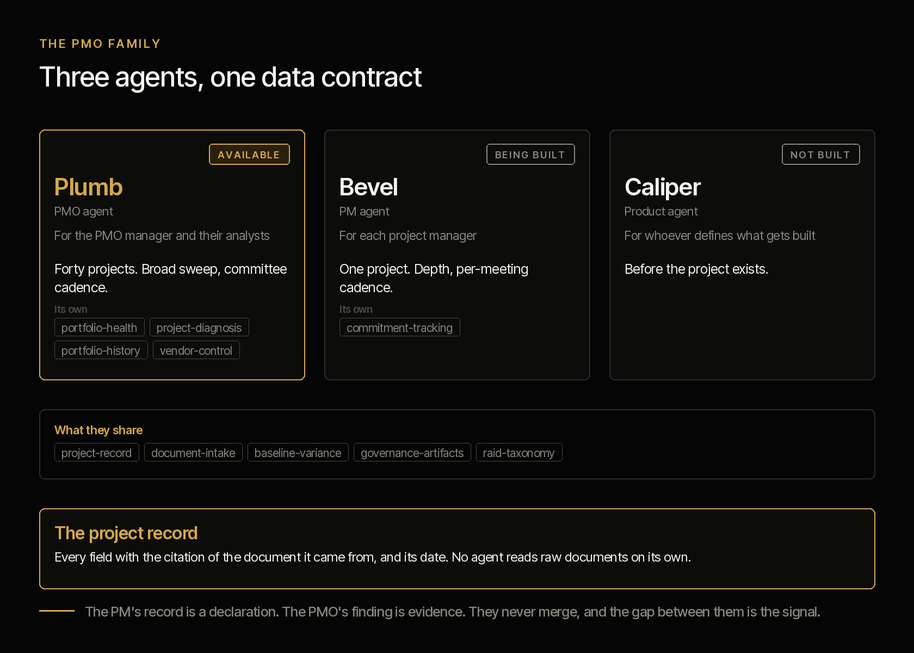
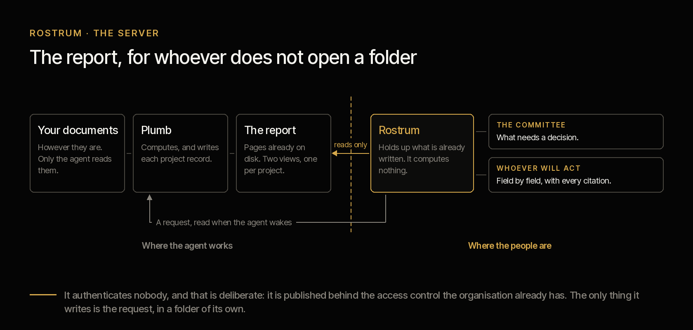

# criterio-pmo

**Plomada, a second brain for the project management office.** It reads the documentation your PMO
already has and says what changed, what contradicts itself, and what has been silent for
weeks.

[Español](README.es.md) · Apache 2.0 · Four clicks to install · **The first result lands in
fifteen minutes, over your own documents**

---

## The PMO family



The capability has more than one agent because the organisation has more than one role.
They are named after drawing instruments, because that is what they do: **Plomada** — a plumb
line — hangs still and tells you whether something is straight, **Escuadra** — a set square —
checks the angle of one piece, **Compás** — a pair of dividers — measures before you draw.

**Plomada is available today**; the other two come behind it and share the same data contract.

**Escuadra**, the project manager's agent, does not attend the meetings — the manager does. What it does is let the
manager arrive with the week prepared: the agenda built beforehand, the minutes drafted
afterwards, the plan current against the evidence, and the report ready except for one line.
Its central function is one no tool a project manager uses today performs: **the commitment
said and not kept.** Meetings are full of *"I'll have it by Friday"* and nobody records them.

**Compás** works before the project exists, and delivers the charter the project
is born from.

---

## Install


**Claude Code**

```
/plugin marketplace add josenanez-company/criterio
/plugin install criterio-pmo@criterio
/pmo-setup
```

## The first fifteen minutes


There is no configuration file to edit, no template to fill in, no folder to tidy before
starting. Setting it up **is a conversation**, and it ends with a result over your documents.

| | |
|---|---|
| **0 – 2 min** | **Install.** Two commands in Claude Code, or four clicks in Cowork |
| **2 – 4 min** | **It looks before it asks.** You point it at the folder where your project documentation lives, however it is. It lists what it found: how many projects it distinguishes, how many documents, which formats, which is the most recent, and which ones it will not be able to read. That is when you know it is actually looking at your things |
| **4 – 8 min** | **Five questions.** Who you are, when your committee meets, who receives the report and in what form, and the terms. One at a time, each with a suggested answer drawn from what it already saw. *"I don't know"* is a valid answer |
| **8 – 15 min** | **A first result.** It sweeps **three projects**, not the whole portfolio, so you see something real in minutes: what it knew about each one, what is not stated anywhere, and any contradiction or overdue commitment it found on the way |

At the end it tells you how long the full portfolio would take, and what your folder is
missing for the analysis to be better. But as a finding, not a requirement: **this works with
whatever is there.**

---

## The agent does not wait to be called


This is the difference between a command and an agent. A command waits. **This one is
scheduled and runs on its own.**

The five questions at setup produce a cadence, and the cadence produces what is due each day.
The decision is date arithmetic, so the code makes it rather than judgement in the moment:

```
python3 scripts/pmo.py due --state <state> --config <file>
```

And `/pmo-wake` is the command the clock invokes: it looks at what is due, does it, and **if
nothing is due it produces nothing.** Staying quiet when nothing happened is not an omission —
it is the only reason an agent that runs every day is still installed a month later.

Three things can be due. The **sweep**, which looks at what changed in the folder and only
recomputes the projects it touched. The **committee report**, which lands with the lead time
you configured so you can react to what it finds. And the **confirmation**, five fields per
run — the ones that age worst: sponsor, manager, approved budget, committed end date and
scope.

Putting it on a clock is on your organisation's side: a scheduled task in Cowork, or the
operating system's scheduler in Claude Code. **And if they do not want unattended runs** — in
a bank that is a reasonable answer — the cadence still says what is due, run by hand. What is
lost is being told without anyone asking.

## Want your sponsor to see this without asking you for it?



Up to here the report is files on your machine. **A sponsor does not open a folder of
files**: they open a link, or they open nothing. That is what the server is for, and it
is this family's additional capability.

```
/pmo-server
```

It raises **a portal with three sections**, which is what makes a team use it instead of
asking you for the report:

| | |
|---|---|
| **PMO reports** | How the portfolio is going: the greens the evidence does not support, what has been silent for weeks, who sponsors more than one thing. And separately, **what needs a decision from the committee** — not the same view trimmed down, a different object |
| **Projects** | The list, and each one's report. Every project **links to the product it came from** |
| **Products** | The list, and each one's report. Every product **links to the projects building it** |

**The link runs both ways, and that is where the thing no other page can say lives.**
Whoever arrives by the project wants to know what it is for. Whoever arrives by the
product wants to know who is building it — and discovers, when it happens, that their
product is built by projects reporting to **different committees**, so none of them is
seeing it whole. A healthy project does not save it either: the product does not land
until all of them land.

The landing page also says how old the report is, which is the thing nobody knows when a
PDF is forwarded to them. And if your configuration says whose project office this is,
the portal carries that name on every page.

And it has one more thing, which is what changes how it gets used: **whoever is looking
can leave the agent a written question.** It does not answer on the spot — the agent is
not running — but the question stays in the queue, and the next time Plomada wakes it
handles it. *"This does not match what I know"* is the most valuable request in the
system: it is a person telling you which document is missing.

### What you have to ask your organisation for

Little, and it helps to have the list before going to ask:

| What is asked for | Why |
|---|---|
| A machine inside the network and a port | That is where it lives. **It does not need to reach the internet** |
| Publishing it behind the access control they already use | See below |
| That machine staying on | If it goes off, the link stops working |

And what you do **not** have to ask for, which is usually half the conversation: no
database, no service account with permissions, no internet access, and nothing touching
any of your documentation folders.

### What the server does not do

- **It does not compute.** It serves pages that were already written to disk. Opening
  the page triggers no document reading, which is why two people see exactly the same
  thing.
- **It does not write any record.** The only thing it creates is the request, in a
  folder of its own. The write path to the portfolio **does not exist in that program**.
- **It authenticates nobody, and that is deliberate.** A hundred-line server on the
  standard library is not going to authenticate better than the proxy your organisation
  already has, and promising it would is exactly what this plugin does not do. So it
  listens only on your machine unless you tell it otherwise, and when you do, it warns
  you.
- **It sends nothing.** No email, no notification. If the report has to reach an inbox,
  today a person forwards it.

## What ends up configured

`/pmo-setup` writes it from your answers, on your machine and in a file of yours: where the
documents are, where the state lives, your committee cadence, the shape of the report, the
thresholds that make it speak, and the record that you accepted the terms, with your name and
the date.

All of it is changed **by talking**. If you want silence reported at ten days instead of
fifteen, you tell it.

## What it never does

This is what is worth being clear about before installing it, and it is not in small print:

- **It does not write in your folders.** It reads your documents; reports and records go to a
  state folder you choose.
- **It does not decide.** It produces working drafts. It frames the decision as a question
  with its options; who decides, and assuming what, belongs to whoever holds the authority.
- **It does not declare a project's status.** The manager does. The agent shows them what
  against, and the gap between the two is the most valuable finding in the system.
- **It does not know what is not written.** It does not know what was said in the corridor or
  decided in a call nobody minuted. Every finding of its own is *"according to the
  documents"*, and it says so.
- **It does not guess.** Every field carries the citation of the document it came from. *"Not
  stated anywhere"* is a valid and expected answer.

And one that has to be said out loud: **your documents are processed on the AI platform's
infrastructure**, not only on your machine. Confirm that is admissible under your policies
before pointing it at confidential material. Full disclaimer in
[DISCLAIMER.md](../../DISCLAIMER.md), terms in [TERMS.md](../../TERMS.md).

---

From here down is for whoever wants to audit it before installing it. **All of this can be
read without running anything**, and that is deliberate.

## How it works


The spine is the **project record**: a data contract every command reads and writes, with the
citation to the source document and its date in every field. No command reads raw documents on
its own. That is what allows consolidating forty projects without reading them again,
**computing instead of opining**, and comparing one run against the previous one.

Three scripts, which are the only things that do not opine. [`scripts/texto.py`](scripts/texto.py)
turns the document into text: `.docx`, `.xlsx` and `.pptx` with the standard library — they
are ZIP files with XML inside —, `.eml` with the email parser, and PDF with `pdftotext`. What
cannot be read is declared with the reason. [`scripts/pmo.py`](scripts/pmo.py) does the
arithmetic, and its `index` subcommand decides the cost of every run: two hashes per document,
one to know whether extracting is worth it and another to know whether re-reading is. And
[`scripts/informe.py`](scripts/informe.py) builds the printed report out of what the other two
produced, without reading a single document again.

## The seventeen commands

| Command | What it does |
|---|---|
| `/pmo-setup` | **The first thing you run.** Looks at your folders, asks five questions and produces the first report over your own documents |
| `/pmo-wake` | **What the clock invokes.** Looks at what is due today, does it, and stays quiet if nothing is |
| `/pmo-server` | Exposes the report for whoever does not open a folder, and says what to ask the organisation for |
| `/document-index` | Which documents actually changed, what has to be re-read, and which citations stopped resolving |
| `/portfolio-scan` | Reads the folder and produces or updates one record per project. The way in |
| `/portfolio-report` | Consolidated report: what changed, what contradicts itself, what is silent, what has no support |
| `/status-report` | A project's status, and the signals its declared light does not account for |
| `/health-check` | Diagnoses a project from zero against the evidence, assuming nothing from its own report |
| `/project-history` | What happened in a project, with the timeline and since when the declared status stopped holding |
| `/steering-pack` | Committee material as a package of decisions, not as a progress report |
| `/raid-log` | Risks, assumptions, issues and dependencies, including the ones said aloud that nobody recorded |
| `/change-control` | Assesses a change across scope, time and cost, and creates a new baseline without deleting the previous one |
| `/budget-tracking` | Approved, committed, executed and projection, with variance against both baselines |
| `/vendor-tracking` | Contractual deliverables against evidence of receipt and against invoicing |
| `/product-view` | The state of a product across every project that builds it |
| `/project-charter` | Reviews or drafts the charter, flagging what is missing and what the gap costs |
| `/project-closure` | Closes against the agreed success criteria, with lessons that can be supported |

## The ten skills

They load on their own when the topic appears. They are the knowledge the commands share, and
they can be read the way a manual is read.

| Skill | What it encapsulates |
|---|---|
| `project-record` | The record: schema, extraction rules, citation, field states, what to do when two documents contradict each other |
| `document-intake` | Which document has to be re-read and which does not, which formats can be read and with what, renaming, deletion, and the citation that stopped resolving |
| `portfolio-health` | The eighteen signals with what each one means, the thresholds that govern them, and the three defences against data that stopped being true |
| `baseline-variance` | Append-only baseline, variance against the original and against the current one, the rebaseline against what the committee authorised, the four budget figures |
| `raid-taxonomy` | The four categories and how to tell them apart, assessment, escalation criteria |
| `commitment-tracking` | Commitments said in meetings: extraction, states, what counts as evidence, and the one repeated with a new date each time |
| `governance-artifacts` | Charter, committee, change control and closure: what each contains and who decides what |
| `vendor-control` | Contract against evidence of receipt against invoicing, with an amount per deliverable |
| `project-diagnosis` | Diagnosis from zero: in what order you read, and when the answer is that it cannot be diagnosed |
| `portfolio-history` | A project's history from its documents, and the point where the evidence separated from what was being reported |

## Out of scope, and why

**Capacity and resource allocation**, and **benefits realisation**. Not because they matter
little: because the data is not in the folder. Capacity requires real hours and benefits
require later measurement that almost no organisation has.

A skill that promises what the input does not allow burns the credibility of the whole plugin.

**No regulatory content.** Portfolio management is method, not regulation: it works the same
in Bogotá as in Santiago. If a regulatory obligation touches a project, this plugin records it
as a constraint or as a risk, and does not opine on it.

## How it is verified

```
python3 scripts/pmo.py selftest          the arithmetic and the cadence
python3 scripts/texto.py --selftest      document conversion
python3 scripts/informe.py --selftest    the report: figures, agreement and naming
python3 scripts/servidor.py --selftest   the server: what it serves and what it never touches
```

All three run on the standard library, with nothing installed. Over synthetic material with known
answers there is a grader and the result of the last run, with what it proves and what it does
not: [`tests/criterio-pmo/`](../../tests/criterio-pmo/).

Acceptance criteria in [ACCEPTANCE.md](ACCEPTANCE.md). The design of the capability, with what
the agent does not do and what remains the people's, in
[`docs/agents/pmo.md`](../../docs/agents/pmo.md) — in Spanish, as working documents.
