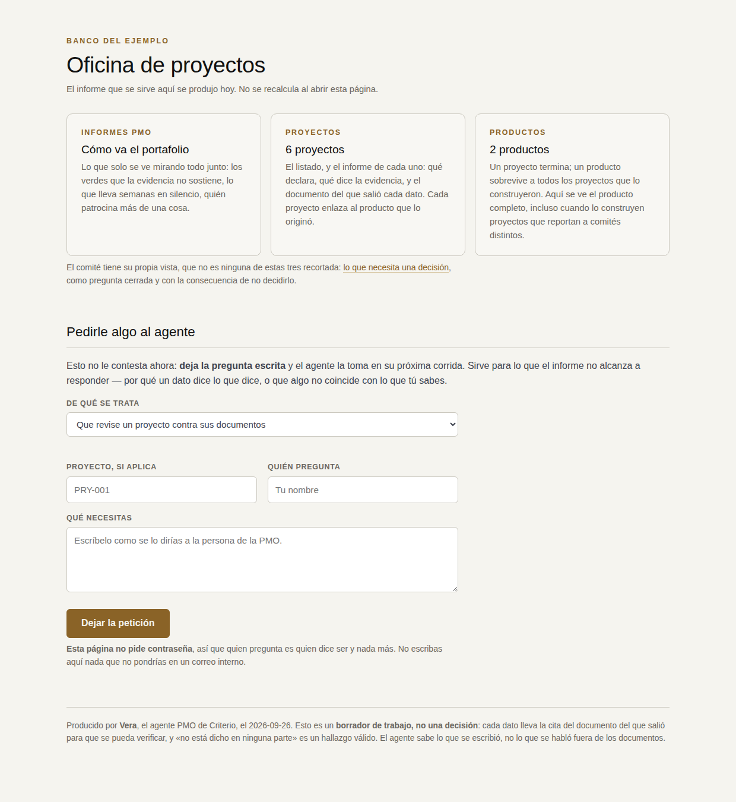
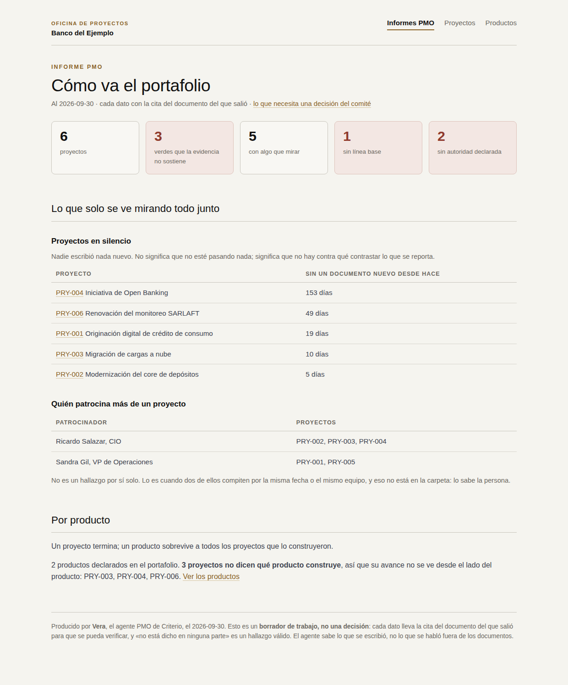
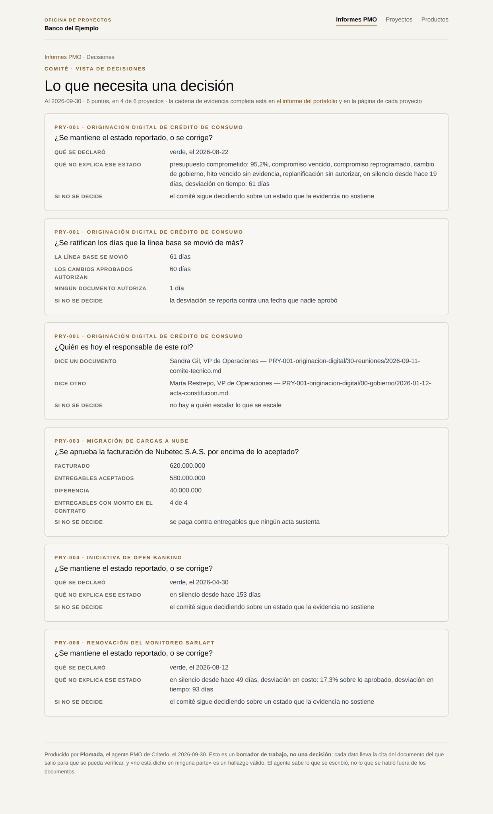
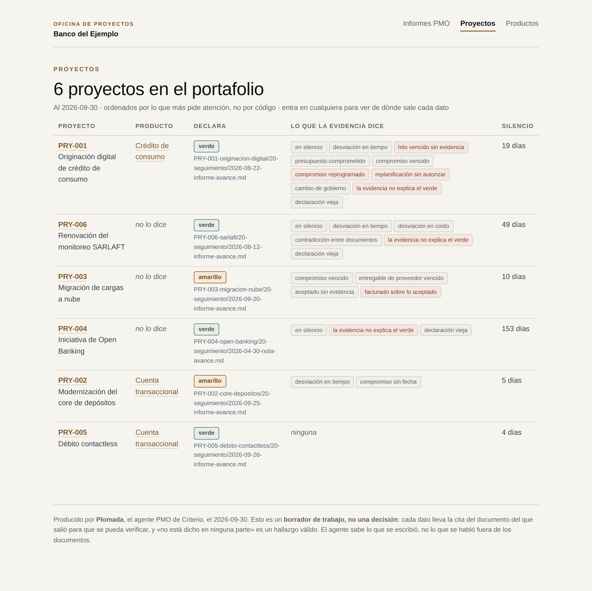
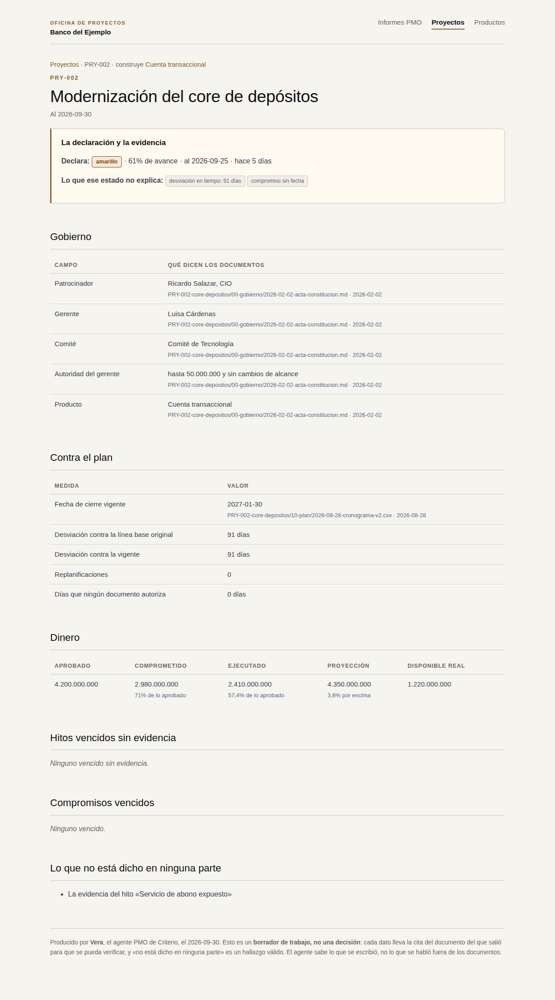
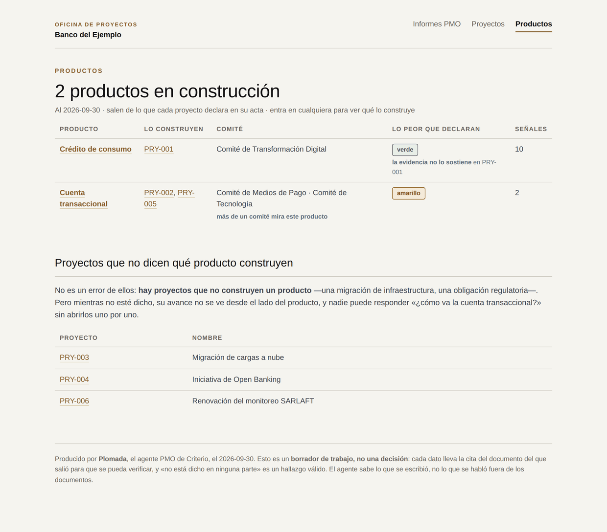
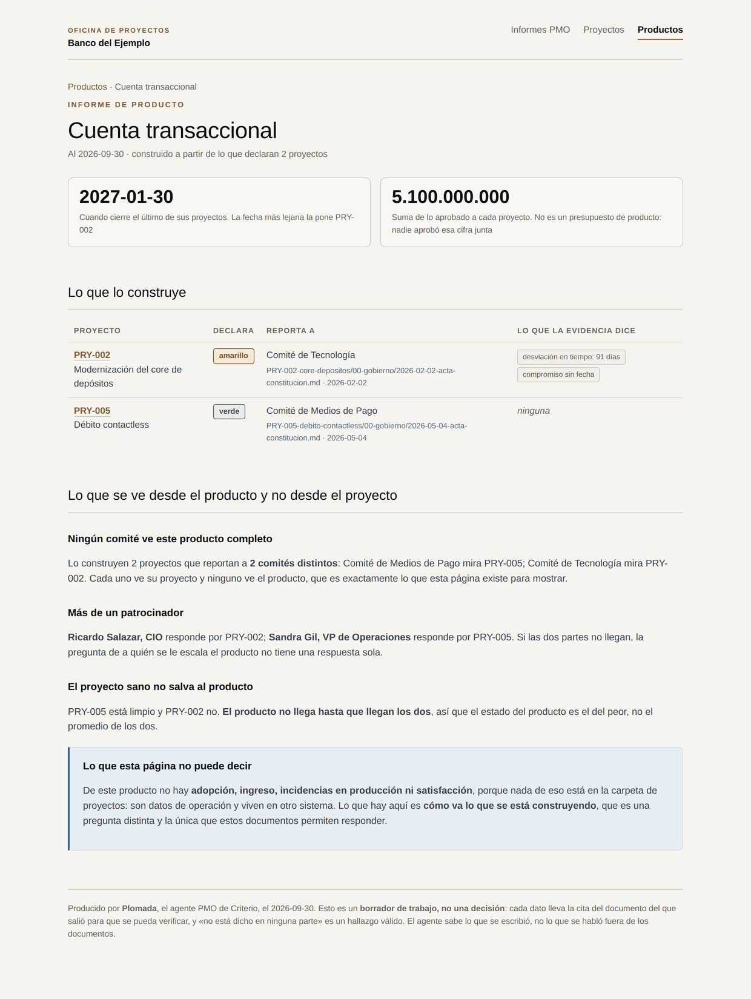

# Rostrum · el servidor de criterio-pmo

**El informe, para quien no abre una carpeta.**

Una tribuna no mide, no corrige y no opina: **sostiene lo que ya está escrito, a la
altura de quien lo va a leer.** Por eso se llama así — y si algún día calculara algo, el nombre
dejaría de ser cierto.

[English](SERVER.md) · vuelve al [README del plugin](README.es.md)

---


Vera produce el informe como archivos en tu equipo. Eso le sirve a quien lo corrió,
y a nadie más. **Un patrocinador no abre una carpeta de archivos**: abre un enlace, o
no abre nada.

**Rostrum** convierte esos archivos en un portal que tu equipo puede consultar, y —esto es
lo que cambia cómo se usa— **le deja dejarle preguntas escritas al agente**.

## Levantarlo

Primero el informe, después Rostrum. **Rostrum no genera el informe: lo sostiene.**

```
/portfolio-report html
/pmo-server
```

O a mano, que es lo mismo que hace el comando:

```
python3 scripts/informe.py  --state <estado> --salida <carpeta> --config <archivo>
python3 scripts/servidor.py --informe <carpeta> --estado <estado> --config <archivo>
```

Escucha en `127.0.0.1:8787`, **solo en tu equipo**, y se para con Ctrl-C. Si el puerto
está ocupado, `--puerto 8788`. Con `--config` el portal lleva el nombre de tu
organización en todas las páginas; sin él, dice «Portafolio» a secas.

---

## Lo que ve quien entra



Tres secciones, en el orden en que alguien pregunta: **cómo va todo, después el
proyecto que le toca, después el producto que le importa.**

La portada dice además **de cuándo es el informe**, que es precisamente lo que nadie
sabe cuando le reenvían un PDF. No se recalcula al abrir la página, y eso se declara
en vez de disimularlo.

> Las capturas de esta página salen del [corpus sintético](../../tests/criterio-pmo/)
> del repositorio, al 2026-09-30. «Banco del Ejemplo» es material de prueba.

### 1 · Informes PMO — cómo va el portafolio



Lo que **solo se ve mirando todo junto**, y por eso no está en la página de ningún
proyecto: cuántos verdes la evidencia no sostiene, qué lleva semanas sin un documento
nuevo, y quién patrocina más de una cosa a la vez.

Esa última no es un hallazgo por sí sola, y la página lo dice: lo es cuando dos de esos
proyectos compiten por la misma fecha o el mismo equipo, **y eso no está en la carpeta
— lo sabe la persona.**

### El comité tiene su propia vista



No es la anterior recortada: **es otro objeto**. Solo lo que excede la facultad de
quien gerencia cada proyecto, formulado como pregunta cerrada, con sus cifras y con la
**consecuencia de no decidirlo**.

La diferencia importa. A un patrocinador se le entrega la vista interna filtrada y hace
lo que hacen los patrocinadores: se clava en un detalle y desvía el comité. Aquí cada
bloque es una decisión suya, y si no hay ninguna, lo dice.

### 2 · Proyectos



El listado, **ordenado por lo que más pide atención y no por código**. Cada fila trae
lo que el proyecto declara, lo que la evidencia dice, cuánto lleva en silencio, y el
producto al que pertenece.



Y dentro, el informe: gobierno, plan, dinero, hitos vencidos, compromisos vencidos, y
**lo que no está dicho en ninguna parte**. Cada dato con la cita del documento del que
salió y su fecha, para que se pueda abrir y verificar.

Arriba del todo, el enlace al **producto que le dio origen**.

### 3 · Productos



Un proyecto termina; un producto sobrevive a todos los proyectos que lo construyeron.

El listado marca dos cosas que un informe de portafolio normal no marca: cuándo **más
de un comité mira el mismo producto**, y cuándo el semáforo que sus proyectos declaran
**no lo sostiene la evidencia**. Un producto en verde con diez señales es exactamente
la lectura que este portal existe para no permitir.

Abajo, los proyectos que no dicen qué producto construyen. No es un error de ellos
—hay proyectos que no construyen un producto—, pero mientras no esté dicho su avance no
se ve desde ese lado.



**Aquí está lo que ninguna otra página puede decir.** Cuando un producto lo construyen
dos proyectos que reportan a comités distintos, cada comité ve su proyecto y **ninguno
ve el producto**. Desde adentro de un proyecto eso no se puede detectar, porque desde
adentro no se ve el otro.

De ahí salen las tres cosas propias de esta página:

- **Ningún comité lo ve completo**, con cuál mira cuál.
- **Más de un patrocinador responde por él**, y entonces no hay una sola respuesta a
  quién se le escala.
- **El proyecto sano no salva al producto**: no llega hasta que llegan todos, así que
  su estado es el del peor y no el promedio.

Y lo que la página **no** dice, declarado en la propia página: de este producto no hay
adopción, ingreso, incidencias en producción ni satisfacción. Nada de eso está en la
carpeta de proyectos — son datos de operación y viven en otro sistema.

---

## Pedirle algo al agente

En la portada hay un formulario. **No le contesta a nadie en el momento**, y decirlo es
más honesto que un «en breve te contactamos»: escribe la pregunta en la cola y el
agente la atiende cuando despierte.

Tres asuntos, y el tercero es el de más valor:

| Asunto | Qué hace el agente |
|---|---|
| *Que revise un proyecto contra sus documentos* | Lo diagnostica desde cero, sin asumir nada de su informe |
| *Que explique de dónde salió un dato* | Rastrea el dato hasta su documento y lo cita |
| *Que algo del informe no coincide con lo que sé* | **Alguien está diciendo qué documento falta.** Se registra como hallazgo, con quién lo dijo y cuándo — no se escribe en la ficha |

Ese último es el que convierte el portal en algo más que una pantalla. La persona que
sabe que el patrocinador cambió en el comité del 11 no va a ir a arreglar un acta; va a
decírselo a lo que tenga delante, si lo que tiene delante escucha.

**Una petición abierta rompe el silencio del agente.** Es la única cosa que le hace
hablar sin ser aritmética de fechas, porque una persona preguntó y está esperando:

```
python3 scripts/pmo.py due       --state <estado> --config <archivo>
python3 scripts/pmo.py requests  --state <estado>
python3 scripts/pmo.py answered  --state <estado> --id <identificador>
```

Una petición sin marcar vuelve a aparecer mañana, y eso es correcto.

## Publicarlo dentro de tu organización

Hay dos formas y no dan lo mismo. Si no sabes cuál quieres, **empieza por la primera**:
se levanta en diez segundos, y con eso funcionando en la mano la conversación con
seguridad ya no es pedir permiso para una idea.

**Para mirarlo un rato.** Alguien lo levanta, mira, y lo apaga. Cero infraestructura
que pedirle a nadie. Lo que se pierde: el patrocinador no tiene un enlace que funcione
mañana.

**Que quede corriendo.** Vive en una máquina de la PMO y el patrocinador tiene un
enlace estable. Es donde está el valor, y también la conversación. `--abierto` hace que
escuche fuera del equipo, y el programa lo advierte al arrancar.

### Qué hay que pedir

| Qué se pide | Por qué |
|---|---|
| Una máquina dentro de la red y un puerto | Es donde vive. **No necesita salir a internet** |
| Publicarlo detrás del control de acceso que ya usan | Ver abajo |
| Que esa máquina siga encendida | Si se apaga, el enlace deja de funcionar. No hay alta disponibilidad y no hace falta: el informe se regenera |

### Qué **no** hay que pedir

Suele ser la mitad de la conversación, así que conviene llevarlo escrito: no necesita
base de datos, ni cuenta de servicio con permisos, ni certificado propio, ni salida a
internet, ni tocar ninguna de tus carpetas de documentación.

## Lo que Rostrum nunca hace

- **No calcula.** Sirve páginas que ya estaban escritas en disco. Abrir la página no
  dispara ninguna lectura de documentos, y por eso dos personas ven exactamente lo
  mismo. Si calculara al vuelo, el portafolio dejaría de ser uno solo.
- **No escribe ninguna ficha.** Lo único que crea es el archivo de la petición, en una
  carpeta suya. **El camino de escritura hacia el portafolio no existe en ese
  programa**, y el selftest lo comprueba comparando la ficha byte a byte antes y
  después de mandar una petición.
- **No autentica a nadie, y es a propósito.** Un servidor de cien líneas sobre la
  librería estándar no va a autenticar mejor que el proxy que tu organización ya tiene,
  y prometer que sí sería exactamente lo que este plugin no hace. Por eso escucha solo
  en tu equipo salvo que le digas lo contrario, y cuando se lo dices, lo advierte.
- **No manda nada.** No hay correo ni notificación. Si el informe tiene que llegar a un
  buzón, hoy lo reenvía una persona.

---

De aquí para abajo es para quien lo va a publicar.

## Las rutas

| Ruta | Qué es | Para quién |
|---|---|---|
| `/` | La portada, con las tres secciones y el formulario | Todos |
| `/pmo` | Cómo va el portafolio | La PMO |
| `/decisiones` | Lo que necesita una decisión | El comité y el patrocinador |
| `/proyectos` | El listado de proyectos | Todos |
| `/p/<código>` | El informe de un proyecto | Quien gerencia, y quien pregunta |
| `/productos` | El listado de productos | Quien responde por un producto |
| `/producto/<nombre>` | El informe de un producto | Quien responde por un producto |
| `/estado.json` | De cuándo es el informe y cuántas peticiones hay abiertas | Un mecanismo, no una persona |
| `/peticion` | `POST` · deja una pregunta para el agente | El formulario de la portada |

Las rutas con nombre **redirigen al archivo** en vez de servirlo en su lugar. La razón
es que las páginas enlazan entre sí por nombre de archivo, porque tienen que funcionar
también **abiertas desde el disco, comprimidas o impresas**: el servidor es una
proyección, no el dueño. Si `/pmo` sirviera el archivo sin redirigir, sus enlaces
apuntarían a rutas que desde ahí no existen.

`/estado.json` es el punto por el que un mecanismo de tu organización puede enterarse
de que hay informe nuevo, si algún día quieres que llegue solo a un buzón. **Mandar
correos en nombre de alguien es una facultad que este agente no va a tener**, así que
ese paso lo da algo tuyo, no el plugin.

## Cómo se verifica

```
python3 scripts/servidor.py --selftest
```

Treinta comprobaciones, con la librería estándar y sin levantar nada a mano. Un
servidor que expone un portafolio tiene **dos formas de fallar que no se ven mirando la
pantalla**, y son las que se comprueban: que sirva un archivo que no es del informe
—rutas con `..`, rutas absolutas, un vecino en disco— y que tenga un camino de
escritura hacia la ficha.

Además: que las tres secciones del servidor sean las mismas que las de `informe.py`,
que cada ruta declarada responda de verdad, y que cada redirección aterrice en una
página que existe. Una redirección a una página que no está es un 404 con un rodeo.

El detalle de la corrida, en
[`tests/criterio-pmo/EVIDENCIA.md`](../../tests/criterio-pmo/EVIDENCIA.md).
