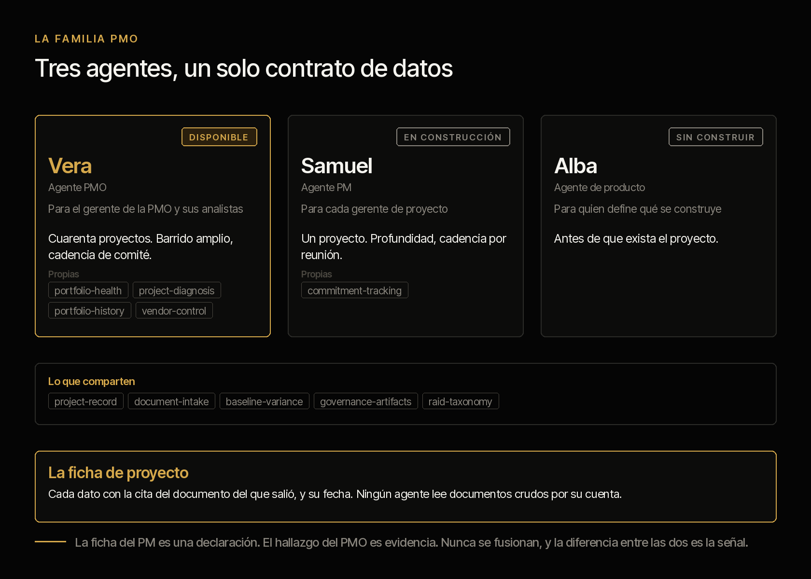
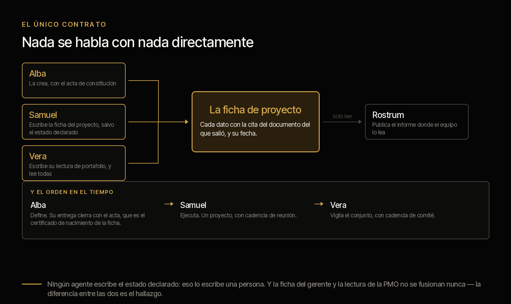

# criterio-portfolio · la familia PMO

**Tres agentes y un servidor, alrededor de un solo contrato de datos.** Cada uno extiende a una
persona distinta de la cadena —quien define el producto, quien ejecuta el proyecto, quien vigila
el portafolio— y ninguno habla con otro directamente: se hablan por la ficha del proyecto.

[English](README.md) · Apache 2.0 · Los tres se instalan hoy

**Esta es la página de la familia.** Explica qué es, quién la compone, cómo se instala, de qué
responde cada agente y cómo se verifica el conjunto. **El detalle de cada agente está en su
propia página**, y cada una se lee sola: se puede instalar un agente sin los otros.

- **[Vera](VERA.es.md)** · el agente de la PMO — y **[Rostrum](SERVER.es.md)**, el servidor que publica su informe
- **[Samuel](../criterio-project/README.es.md)** · el agente del gerente de proyecto
- **[Alba](../criterio-product/README.es.md)** · el agente del gerente de producto

---

## La familia PMO



La capacidad tiene más de un agente porque la organización tiene más de un rol. Llevan nombre
de persona porque **son capacidades extendidas de personas**, y el significado de cada
nombre apunta a lo que hace: **Vera** —de *verus*, lo verdadero— dice lo que los documentos
dicen y no lo que se reporta; **Samuel** —«el que escuchó»— recuerda el viernes lo que se
dijo en la reunión; **Alba** trabaja antes de que amanezca el proyecto.

**Los tres se instalan hoy**, cada uno con su propio plugin, y comparten el mismo contrato
de datos. Los tres tienen también la misma deuda, y está escrita en su página: construidos y
verificados sobre corpus sintético, **no probados todavía sobre la documentación real de una
organización.**

**Samuel**, el agente del gerente de proyecto, no va a las reuniones — el gerente va. Lo que hace es que el gerente llegue
con la semana preparada: la agenda armada antes, la minuta redactada después, el plan al día
contra la evidencia y el informe listo salvo una línea. Su función central no la hace ninguna
herramienta que un gerente use hoy: **el compromiso dicho y no cumplido.** Las reuniones están
llenas de *«yo lo tengo para el viernes»* y nadie los registra.

**Alba** trabaja antes de que exista el proyecto, y entrega el acta con la
que el proyecto nace.

---

## Cómo operan los tres


El orden temporal es lo que los hace un sistema y no tres herramientas. **Dos ciclos cerrados, y ninguno pasa por una base de datos compartida.** El acta baja una
vez, y con ella nace la ficha. La ficha del gerente sube publicada como un documento más del
proyecto, y Vera la lee como lee todo lo demás. El informe sale al equipo, y del equipo vuelve
una petición. Y el lazo de arriba: Alba lee las fichas de los proyectos para confirmar que el
que dice estar construyendo su producto de verdad lo esté.

Lo que **no** hay en ese dibujo es tan importante como lo que hay:

- **Ninguna flecha entre dos agentes.** Todas pasan por un documento. Dos agentes que se
  hablan directo son dos agentes que hay que desplegar juntos.
- **Ninguna flecha de vuelta desde Rostrum a la ficha.** El servidor no escribe.
- **Ninguna flecha que escriba el estado declarado.** Esa la escribe una persona, en los tres
  sitios donde aparece.

**Y las personas están en el mismo dibujo, abajo.** El insumo de cada agente lo produce el trabajo no delegable de su persona.** Quitar a la
persona no deja al agente solo: lo deja sin comida.

## Los tres agentes y el único contrato

Nada se habla con nada directamente. **La ficha de proyecto es el único contrato.**



El Product Manager trabaja antes de que exista plan: no escribe en la ficha, **la crea**. Su
entrega cierra con el acta de constitución, que es el certificado de nacimiento de la ficha.

### Las siete invariantes

1. **Los agentes no se hablan entre sí.** Se hablan por la ficha.
2. **Rostrum, el servidor, no escribe.**
3. **La fuente puede cambiar; la ficha no.** Un adaptador nuevo llena los mismos campos.
4. **Declarado y evidenciado nunca se fusionan**, venga de archivo o de base de datos.
5. **El modelo extrae, el código calcula.**
6. **Ningún agente escribe la declaración.** El estado declarado lo escribe una persona.
7. **Una ficha, un escritor.** Dos agentes que leen los mismos documentos escriben dos
   fichas, y no se fusionan nunca. La diferencia entre las dos es el hallazgo.

La sexta es la más fácil de romper por conveniencia y la que se lleva el sistema entero si se
rompe: si el agente declara, la comparación entre declaración y evidencia compara al sistema
consigo mismo, y todo esto se vuelve un generador de informes bonitos. No es una recomendación
de la documentación: es una restricción del camino de escritura, y falla si se intenta.

La séptima es la cuarta un nivel más arriba, y aparece en cuanto hay más de un agente sobre
el mismo proyecto. La forma cómoda de resolverlo —una ficha y un dueño— obliga a elegir mal
en las dos direcciones: si manda el gerente, la PMO no puede leer por su cuenta cuando duda;
si manda la PMO, entra en el camino crítico de setenta proyectos. Dos fichas quitan el
problema en vez de arbitrarlo, y **lo que era un conflicto de escritura se vuelve la señal.**
Ver [Samuel · las dos fichas](../criterio-project/DISENO.es.md#las-dos-fichas).

## Lo que comparten los tres

No es una colección de asistentes sueltos. Los tres se construyen sobre las mismas cinco
conductas, y no son estilo: son las que hacen que su salida se pueda poner frente a un comité.

1. **Cada dato lleva la cita del documento de donde salió**, con su fecha. Un dato sin fuente
   es un defecto, no un caso degradado.
2. **«No está dicho en ninguna parte» es una respuesta válida**, y es la que más se usa al
   principio.
3. **Se callan cuando no hay nada.** Ninguno produce un informe para decir que no hay novedad.
   Un agente que reporta todas las semanas haya o no noticia se ignora en un mes.
4. **Ninguno declara.** Ninguno escribe el estado de un proyecto ni decide qué se construye.
5. **Ninguno le escribe a nadie.** Producen la lista; perseguir a alguien es una conversación.

Lo que cambia entre uno y otro es **el ritmo de la conversación**, y eso está en la página de
cada uno.

## Lo que sigue siendo de las personas

Los tres roles siguen existiendo completos. Esto extiende capacidad; no sustituye función. Y el
argumento no es de cortesía, es estructural:

> **El insumo de cada agente lo produce el trabajo no delegable de su persona.**

El agente PM necesita que alguien dirija la reunión, porque de ahí sale la minuta que lo
alimenta. El agente PMO necesita que alguien persiga lo que el informe pide, porque si nadie
actúa el informe siguiente dice lo mismo. El agente de producto necesita que alguien hable con
el cliente, porque no hay síntesis sin entrevista.

Quitar a la persona no deja al agente solo: lo deja sin comida. Cada hoja documenta qué se
rompe primero si se intenta, y en qué orden.

## Estado

**Los tres están construidos y se pueden instalar hoy**, y los tres tienen la misma deuda,
que conviene no esconder: **verificados sobre corpus sintético, no probados sobre la
documentación real de una organización.**

| Agente | Se instala | Tablas A y B de su diseño |
|---|---|---|
| **Vera** · PMO | `criterio-portfolio` · 17 comandos, 10 skills | **sin filas abiertas** |
| **Samuel** · proyecto | `criterio-project` · 9 comandos, 8 skills | **sin filas abiertas** |
| **Alba** · producto | `criterio-product` · 11 comandos, 12 skills | **sin filas abiertas** |
| **Rostrum** · el servidor | dentro de `criterio-portfolio` | — |

**Ninguna de las tres hojas de diseño tiene ya una fila en «Falta» o en «Parcial».** Lo que
sigue pendiente no es construcción.

Y una deuda que es de los tres a la vez: **la extracción nunca se ha corrido.** Los tres
corpus siembran el estado desde sus respuestas de referencia, así que la cadena documento →
modelo → ficha no se ha ejercitado.

La corrida que sostiene estos estados, con lo que prueba y lo que no, está en las tres
páginas de evidencia bajo [`tests/`](../../tests/) y el conjunto en
[`docs/pruebas.md`](../../docs/pruebas.md) — con gráficas, para el navegador, en
[`pruebas.html`](../../docs/pruebas.html). La quinta decisión de la tabla siguiente salió de
ahí y no de una conversación.

## Instalar la familia

Cada agente es un plugin y se instala solo. **No hace falta instalar los tres**: se instala el
que resuelve el rol que tienes.

```
/plugin marketplace add josenanez-company/criterio

/plugin install criterio-portfolio@criterio      si gestionas el portafolio
/plugin install criterio-project@criterio       si gestionas un proyecto
/plugin install criterio-product@criterio  si defines un producto
```

**En Claude Cowork** — Personalizar → Explorar plugins → Personal → **+** → Agregar
marketplace desde GitHub → `josenanez-company/criterio`.

Después de instalar, cada agente tiene su propio comando de instalación que mira tus carpetas,
hace unas pocas preguntas y produce un primer resultado sobre tus propios documentos. **Nadie
edita un archivo de configuración a mano.**

Y si instalas más de uno, se encuentran solos: **no hay nada que conectar.** Se hablan por la
ficha, que es un documento en la carpeta del proyecto.

## De qué responde cada agente, y dónde está su detalle

Las cuatro piezas, con lo mismo para cada una: de qué responde, qué no hace, y dónde está todo
su detalle. **Cada página de agente se lee sola** — alguien puede instalar uno sin los otros.

| | De qué responde | Lo que nunca hace | Su página | Sus pruebas |
|---|---|---|---|---|
| **Vera** · la PMO | El portafolio completo: consolidar, contrastar lo declarado contra la evidencia, y armar el material del comité | No declara el estado de ningún proyecto, y no prioriza la demanda | [VERA.es.md](VERA.es.md) · 17 comandos, 10 skills | [resultados](../../tests/criterio-portfolio/RESULTADOS.md) |
| **Samuel** · un proyecto | Lo que la reunión deja escrito: el compromiso dicho y no cumplido, el plan contra la evidencia, y el informe listo salvo una línea | No declara el estado de su proyecto, y no va a la reunión | [criterio-project](../criterio-project/README.es.md) · 9 comandos, 8 skills | [resultados](../../tests/criterio-project/RESULTADOS.md) |
| **Alba** · un producto | Lo que hay antes del proyecto: la definición contra la evidencia de demanda, el registro de requerimientos, y el acta con la que nace la ficha | No decide qué se construye, y no habla con el cliente | [criterio-product](../criterio-product/README.es.md) · 11 comandos, 12 skills | [resultados](../../tests/criterio-product/RESULTADOS.md) |
| **Rostrum** · el servidor | Publicar el informe donde el equipo lo lea, y recibir la petición de quien no abre una carpeta | **No escribe nunca la ficha**, y no decide nada | [SERVER.es.md](SERVER.es.md) | dentro de las de Vera |

**La frontera es la misma para los tres y no es una recomendación: es una restricción del
camino de escritura.** Ninguno escribe el estado declarado de un proyecto. Esa línea la escribe
una persona, y sin ella la comparación entre lo declarado y lo evidenciado —que es de lo que
vive todo esto— compararía al sistema consigo mismo.

## Cómo se configura y cada cuánto corre cada uno

Esta es la tabla que responde tres preguntas a la vez: **dónde se ve cada agente, qué le
hace falta configurado, y cada cuánto tiene sentido que corra.**

| | Vera | Samuel | Alba |
|---|---|---|---|
| **Se instala** | `criterio-portfolio` | `criterio-project` | `criterio-product` |
| **Instancias** | Una por PMO | **Una por proyecto** | **Una por producto** |
| **Se configura con** | `/portfolio-setup` | `/pm-setup` | `/product-setup` |
| **Cuánto tarda eso** | Quince minutos | Diez | Diez |
| **Qué le tienes que decir** | Dónde está la documentación, cuándo es el comité, quién eres | Dónde está tu proyecto, cuándo es tu reunión, quién eres | Dónde está la definición, quién decide qué se construye, quién eres |
| **Dónde queda** | Un archivo de la persona, escrito por el comando | Igual | Igual |
| **El que se le pone a un reloj** | `/portfolio-wake` | `/pm-wake` | `/product-wake` |
| **Cadencia que tiene sentido** | Diaria si el barrido está activo; y el informe con su anticipación al comité | Diaria con barrido, o el día antes y el día después de la reunión | **Semanal alcanza** |
| **Qué lo despierta además del reloj** | Una petición que alguien dejó en Rostrum | Una minuta nueva en la carpeta | Que algo cruzara un umbral solo |

**Nadie edita un archivo de configuración a mano.** Es una regla de los tres comandos de
instalación, no una cortesía: si para cambiar un umbral hay que abrir un JSON, el umbral se
queda como vino y la configuración deja de describir a la organización. Se dice en la
conversación y el comando lo reescribe.

Cada plugin trae su `scripts/config.example.json` para ver la forma completa sin instalar
nada.

### Por qué las tres cadencias son distintas

No es una preferencia: **cada agente mide contra otra cosa.**

- **Vera** mide contra la carpeta. Un documento nuevo puede cambiar el estado de un
  proyecto hoy, así que el barrido diario tiene sentido y el informe se entrega con
  anticipación al comité — para que el gerente de la PMO alcance a reaccionar a lo que
  encuentre, no para que se entere cuando ya está enviado.
- **Samuel** mide contra la reunión. Su ciclo no es el calendario: es *antes de la reunión*
  y *después de la reunión*, y por eso `/pm-wake` mira de qué lado estás antes de ofrecer
  nada.
- **Alba** mide contra el paso del tiempo, y eso cambia todo. Sus umbrales se cuentan en
  meses, así que una corrida diaria sobre un registro que se mueve poco es ruido con
  puntualidad. **Pero es la única de los tres cuyos hallazgos aparecen sin que nadie haga
  nada**: el requerimiento que llevaba cincuenta y nueve días sin decidirse llega a
  sesenta, y nadie va a abrir una sesión para preguntar si eso ya pasó.

### Los tres se callan cuando no hay nada

Es la regla que decide si un agente sigue instalado el mes siguiente. Los tres comandos de
reloj devuelven `quiet` cuando no toca nada, y con `quiet` la salida es una línea: qué se
revisó y cuándo vuelve.

Un agente que produce un informe para decir que no hay novedad enseña a ignorarlo, y el día
que sí hay novedad ya nadie lo abre.

### Qué es lo que **no** está programado

Conviene decirlo aquí y no en una nota al pie: **ninguno de los tres se programa solo.**
Los tres traen el comando que un reloj invoca, y el reloj vive fuera del plugin — una tarea
programada de Claude Cowork, o el programador del sistema operativo invocando Claude en
modo no interactivo. Alguien tiene que ponerlo, una vez, y cada comando de reloj explica
cómo.

Y para que corra sin nadie delante hacen falta dos cosas que no dependen de este
repositorio: **que la sesión pueda correr sin aprobar cada paso**, y **que la carpeta esté
montada cuando el reloj dispare.**

**Si la organización no quiere corridas desatendidas** —y en un banco es una respuesta
razonable— los tres comandos sirven corridos a mano, y la cadencia sigue diciendo qué toca.
Lo que se pierde es que avisen sin que nadie pregunte, que es justamente lo que más cuesta
ver a mano.

## Las pruebas de la familia

**Una sola puerta corre todo lo que este repositorio verifica**, de los tres agentes a la vez:

```
python3 scripts/verificar.py
```

Es el equivalente de una prueba integral: no verifica un agente, verifica **que la familia
siga siendo una familia.** Lo propio de cada agente —su aritmética, su corpus, sus respuestas
escritas a mano— lo responde su página; aquí se verifica lo que ninguno puede responder solo:

| Qué se verifica del conjunto | Por qué es de la familia y no de un agente |
|---|---|
| Que la documentación y el código digan lo mismo | Una señal que un agente calcula y su skill no explica rompe la promesa de todos |
| Que el marketplace y cada plugin estén completos | Un plugin que se instala sin su README es un agente que llega mudo |
| **Que las copias compartidas no se hayan separado** | Los tres comparten aritmética por copia, no por importación. Dos copias que se separan calculan distinto sobre los mismos documentos, y nadie sabría a cuál creerle |
| Que cada agente tenga su análisis de pruebas y esté enlazado | Un resultado que nadie puede abrir es un resultado que no existe |

**El resultado del conjunto, generado desde la corrida**, en
[`docs/pruebas.md`](../../docs/pruebas.md) — y con gráficas, para abrir en un navegador, en
[`pruebas.html`](../../docs/pruebas.html).

**Y el de cada agente, en su propia página**, porque cada uno responde por lo suyo:
[Vera](../../tests/criterio-portfolio/RESULTADOS.md) ·
[Samuel](../../tests/criterio-project/RESULTADOS.md) ·
[Alba](../../tests/criterio-product/RESULTADOS.md).

Todo corre con la librería estándar y sin instalar nada. Qué prueba cada corpus y, con el mismo
detalle, **qué no**, en las tres páginas de evidencia bajo [`tests/`](../../tests/).

## Los dieciocho skills de la familia

Dieciocho skills distintos entre los tres agentes. **Los que comparten son copias literales, no un módulo importado**: un plugin instalado tiene que correr solo, y un `import` a la ruta del otro funciona aquí y falla en el equipo de quien lo instaló.

`scripts/sincronizar.py` las copia y `tests/coherencia.py` falla si se separan.

| Skill | Vera | Samuel | Alba |
|---|:--:|:--:|:--:|
| `assumption-tracking` | · | · | ● |
| `baseline-variance` | ● | ● | · |
| `commitment-tracking` | ● | ● | · |
| `demand-evidence` | · | · | ● |
| `discovery-synthesis` | · | · | ● |
| `document-intake` | ● | ● | ● |
| `governance-artifacts` | ● | ● | ● |
| `portfolio-health` | ● | · | · |
| `portfolio-history` | ● | · | · |
| `product-health` | · | · | ● |
| `product-metrics` | · | · | ● |
| `project-diagnosis` | ● | ● | · |
| `project-record` | ● | ● | ● |
| `raid-taxonomy` | ● | ● | ● |
| `regulatory-sweep` | · | · | ● |
| `requirement-record` | · | · | ● |
| `specification-draft` | · | · | ● |
| `vendor-control` | ● | ● | · |

