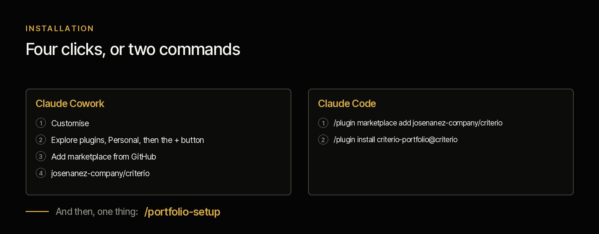
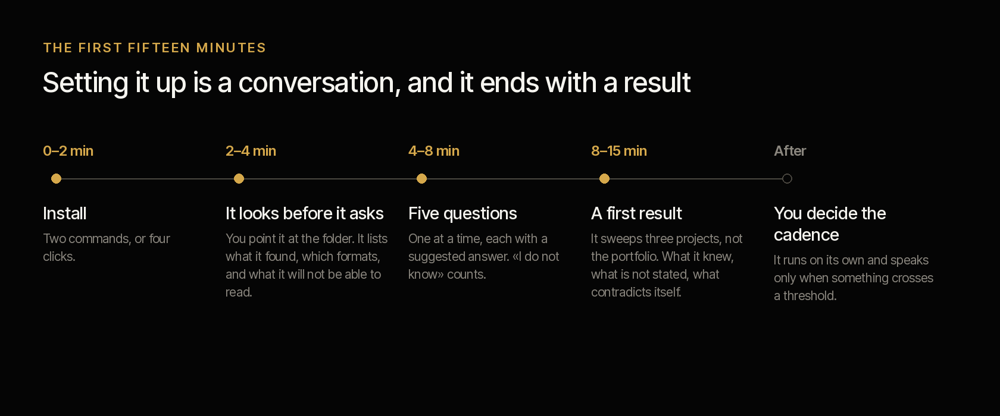
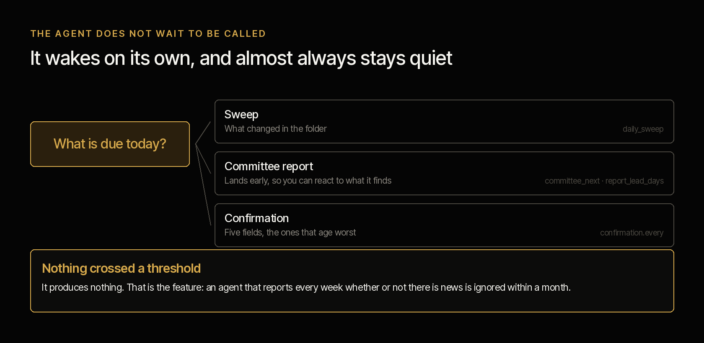
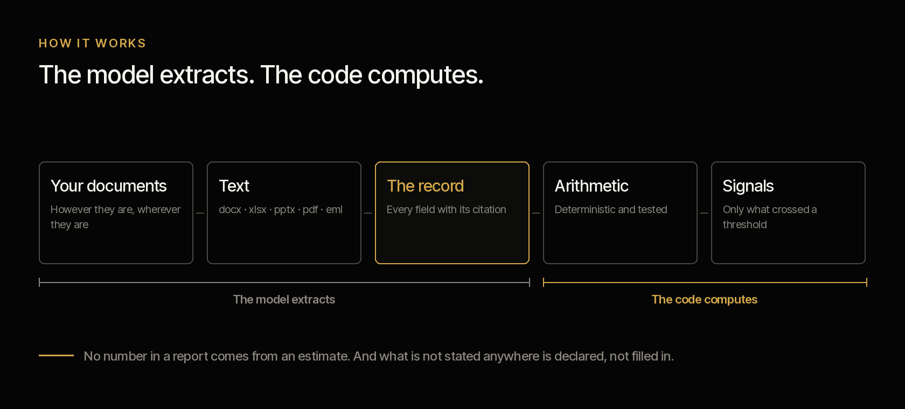

# Vera · project director

**A second brain for whoever answers for the whole portfolio.** It reads the documentation your PMO
already has and says what changed, what contradicts what, and what has gone quiet for weeks.

[Español](README.es.md) · Apache 2.0 · One instance per project office · Installs in four clicks

**Status: the seventeen commands are built**, along with the ten skills of the method and the
arithmetic verified against a corpus with answers written by hand. **What has not been tested
yet: extraction over a real organisation's documentation.** Nothing is announced as finished
until the [acceptance criteria](DISENO.es.md#criterios-de-aceptación) pass.

**This page reads on its own.** Vera works without her siblings: if all you care about is the
portfolio, everything is here, tests included. The family — how she meets Samuel and Alba
— is in the [repository README](../../README.md), and **the server that publishes her report** is
in [SERVER.md](SERVER.md).

---

## The scope

| | |
|---|---|
| **Whose hands it extends** | The PMO manager's, and the analysts' |
| **What it works on** | **The whole portfolio.** Forty projects, or seventy |
| **What it looks at** | The documentation folder of all of them, in whatever shape it is |
| **Cadence** | A daily sweep if configured, and the report ahead of the committee |
| **Instances** | One per PMO |

**What it does that nobody else does:** contrasting what each manager declares against what
their documents support, **across the whole set and at once**. A project reporting green with
five weeks and no document is not caught by anyone looking at that project: it is caught by
whoever looks at all forty with the same yardstick.

**What it can answer that today nobody answers without days of work:** what changed since the
previous run, what contradicts what between two documents of the same project, what has been
quiet for weeks, how many of those reporting green carry evidence that green does not explain,
and who is reached when a project moves.

## Installation



**Claude Code**

```
/plugin marketplace add josenanez-company/criterio
/plugin install criterio-portfolio@criterio
/portfolio-setup
```

**In Claude Cowork** — Customise → Explore plugins → Personal → **+** → Add marketplace from
GitHub → `josenanez-company/criterio`.

If you run a project and not the portfolio, yours is
[Samuel](../criterio-project/README.md). If you define a product,
[Alba](../criterio-product/README.md).

## The first result



There is no configuration file to edit, no template to fill in, no folder to tidy up before
starting. Configuration **is a conversation**, and it ends with a result over your documents.

| | |
|---|---|
| **0 – 2 min** | **Install.** Two commands in Claude Code, or four clicks in Cowork |
| **2 – 4 min** | **It looks before it asks.** You point it at the folder where project documentation lives, in whatever shape it is. It lists what it found: how many projects it distinguishes, how many documents, which formats, which is the most recent, and which it will not be able to read. That is where you know it is really looking at your things |
| **4 – 8 min** | **Five questions.** Who you are, when your committee meets, who receives the report and in what form, and the terms. One at a time, each with a suggested answer drawn from what it already saw. *«I don't know»* is a valid answer |
| **8 – 15 min** | **A first result.** It sweeps **three projects**, not the whole portfolio, so you see something real in minutes: what it learned about each one, what is not stated anywhere, and any contradiction or overdue commitment that turned up on the way |

At the end it tells you how long the whole portfolio would take, and what your folder is
missing for the analysis to be better. But as a finding, not as a requirement: **this works
with whatever is there.**

**What ends up configured** is written by `/portfolio-setup` from your answers, on your machine and in
a file of yours: where the documents are, where status lives, your committee cadence, the shape
of the report, the thresholds that make it raise its voice, and the record that you accepted the
terms, with your name and the date. All of that is changed **by talking**: if you want silence
reported at ten days instead of fifteen, you say so.

## The finding nobody else produces

Moving a project has consequences in projects that are not its own, and nobody does that sum
because it takes looking at the portfolio's whole dependency graph at once.

> **PRY-002 moves 60 days.**
> It reaches **PRY-001**, which depends on its delivery and **can no longer hold its closing
> date: it is 121 days short.**
> Nobody looking at PRY-002 would have seen it, and PRY-001's manager does not yet know he has
> to find out.

That case comes from the synthetic corpus, with the answer written by hand **before** running
the calculation. It is the kind of question that can only be answered from above:
`/change-control` computes it, and also says who has to be told and which dependencies are
unconfirmed.

And it is the same reason Vera exists. What she does is not read one project better — its
manager is there for that — but **apply the same yardstick to all forty**, every day, without
tiring by project number thirty.

## It does not wait to be called



This is the difference between a command and an agent. A command waits. **This one is scheduled
and runs on its own.**

The five questions at setup produce a cadence, and the cadence produces what is due each day.
The decision is date arithmetic, so the code takes it and not the judgement of the moment:

```
python3 scripts/portafolio.py due --state <state> --config <file>
```

And `/portfolio-wake` is the command the clock invokes: it looks at what is due, does it, and **if
nothing is due it produces nothing.** Staying quiet when nothing happened is not an omission —
it is the only reason an agent that runs every day is still installed the following month.

Three things can come due. The **sweep**, which looks at what changed in the folder and only
recomputes the projects touched. The **committee report**, which lands with the lead time you
configured so you can react to what it finds. And the **confirmation**, five fields per run —
the ones that age worst: sponsor, manager, approved budget, closing date and scope.

Putting it on a clock is on your organisation's side: a scheduled task in Cowork, or the
system's scheduler in Claude Code. **And if unattended runs are not welcome** — in a bank that
is a reasonable answer — the cadence still says what is due, run by hand. What you lose is
being told without anyone asking.

**And if you want your sponsor to see it without asking you for it**, `/portfolio-server` raises
**Rostrum**, this family's server: a portal with three sections — PMO reports, projects and
products — where whoever is looking can also **leave the agent a written question**, which stays
in the queue and is answered on the next run. It authenticates nobody, and that is on purpose:
it is published behind the access control your organisation already has.
→ **[Rostrum, with screenshots of each section](SERVER.md)**

## What it never does

This is what is worth being clear about before installing it, and it is not in small print:

- **It does not write in your folders.** It reads your documents; reports and records go to a
  state folder you choose.
- **It does not decide.** It produces working drafts. It frames the decision as a question with
  its options; who decides, and on what assumption, belongs to whoever has the authority.
- **It does not declare a project's status.** The manager does. The agent shows him what
  against, and the difference between the two is the system's most valuable finding.
- **It does not know what is not written.** It knows nothing of the corridor conversation or of
  what was decided on a call nobody minuted. Every finding of its own is *«according to the
  documents»*, and it says so.
- **It does not guess.** Every value comes with the citation of the document it came from.
  *«It is not stated anywhere»* is a valid and expected answer.

**And two things are deliberately absent, even if a tender asks for them: capacity and resource
allocation, and benefits realisation.** Not because they matter little: because the data is not
in the folder. Capacity demands real hours and benefits demand later measurement that almost no
organisation has. A skill that promises what the input does not allow burns the whole plugin's
credibility. It carries no regulatory content either: portfolio management is method, not
regulation, and works the same in Bogotá as in Santiago. If a regulatory obligation touches a
project, it records it as a constraint or as a risk and does not opine on it.

And one that does have to be said out loud: **your documents are processed on the AI platform's
infrastructure**, not only on your machine. Confirm that this is admissible under your policies
before pointing it at confidential material. Full disclaimer in
[DISCLAIMER.md](../../DISCLAIMER.md), terms in [TERMS.md](../../TERMS.md).

---

From here down is for whoever wants to audit it before installing it. **All of this can be read
without running anything**, and that is deliberate.

## How you work with Vera

The three agents share five behaviours, and none is style: they are what makes the result
something you can put in front of a committee. **Every value carries the citation** of its
document and date · **«it is not stated anywhere» is a valid answer** · **they stay quiet when
there is no news** · **none of them declares** · **none of them writes to anybody**. They are
explained in the [family README](../../README.md#what-the-three-share).

What changes between one and another is **the rhythm of the conversation**, and that is worth
knowing before installing.

**With Vera you talk little and read a lot.** She works over forty folders: the conversation is
short — you tell her which project, or none — and what comes back is long, a report somebody
will take to a committee.

**The rhythm:** `/portfolio-setup` once, `/portfolio-wake` on a clock, and after that you ask by exception
— *«diagnose PRY-014 from scratch»*, *«reconstruct what happened»*, *«build the committee
pack»*.

**What it will ask of you:** confirming **five fields per run**, never forty — ask about forty
and nobody answers. And **acting on what the report asks for**: if nobody acts, the next report
says the same thing, and that is not a defect of the agent.

**What not to ask it:** what status a project is in. It tells you what its manager declares and
what the documents support, and **the difference between the two is the product.**

## How it works



The spine is the **project record**: a data contract every command reads and writes, with the
citation of the source document and its date on every field. No command reads raw documents on
its own. That is what makes it possible to consolidate forty projects without reading them
again, to **compute instead of opine**, and to compare one run against the previous one.

Three scripts, which are the only thing that does not opine. [`scripts/texto.py`](scripts/texto.py)
turns the document into text: `.docx`, `.xlsx` and `.pptx` with the standard library — they are
ZIPs with XML inside —, `.eml` with the email parser, and PDF with `pdftotext`. What cannot be
read is declared with the reason. [`scripts/portafolio.py`](scripts/portafolio.py) does the arithmetic, and
its `index` subcommand decides each run's cost: two hashes per document, one to know whether
extracting is worth it and another to know whether re-reading is. And
[`scripts/informe.py`](scripts/informe.py) builds the printed report from what the other two
produced, without reading a single document again.

## The seventeen commands

| Command | What it does |
|---|---|
| `/portfolio-setup` | **The first thing you run.** Looks at your folders, asks five questions and produces the first report over your own documents |
| `/portfolio-wake` | **What the clock invokes.** Looks at what is due today, does it, and if nothing is due it stays quiet |
| `/portfolio-server` | Raises **Rostrum**, the server: exposes the report for whoever will not open a folder, and says what to ask the organisation for |
| `/document-index` | Which documents really changed, what has to be re-read and which citations stopped resolving |
| `/portfolio-scan` | Reads the folder and produces or updates one record per project. The front door |
| `/portfolio-report` | Consolidated report: what changed, what contradicts what, what is quiet, what has no support |
| `/status-report` | A project's status, and the signals its declared traffic light does not explain |
| `/health-check` | Diagnoses a project from scratch against the evidence, assuming nothing from its report |
| `/project-history` | What happened in a project, with the timeline and since when what was declared stopped holding |
| `/steering-pack` | Committee material as a pack of decisions, not as a progress report |
| `/raid-log` | Risks, assumptions, issues and dependencies, including the ones said and never recorded |
| `/change-control` | Assesses a change in scope, time and cost, computes who it reaches, and creates a new baseline without erasing the previous one |
| `/budget-tracking` | Approved, committed, spent and forecast, with variance against both baselines |
| `/vendor-tracking` | Contractual deliverables against evidence of receipt and against invoicing |
| `/product-view` | A product's state across all the projects building it |
| `/project-charter` | Reviews or drafts the charter, pointing out what is missing and what follows from that |
| `/project-closure` | Closes against the agreed success criteria, with lessons that can be supported |

## The ten skills

They load on their own when the subject comes up. They are the knowledge the commands share,
and they read the way a manual reads.

| Skill | What it encapsulates | Whose it is |
|---|---|---|
| `project-record` | The record: schema, extraction rules, citation, field states, what to do when two documents contradict each other | Own · also in Samuel and Alba |
| `document-intake` | Which document has to be re-read and which not, which formats can be read and with what, renaming, deletion, and the citation that stopped resolving | Own · also in Samuel and Alba |
| `portfolio-health` | The twenty signals with what each one means, the thresholds that govern them, and the three defences against the value that stopped being true | Own |
| `baseline-variance` | Append-only baseline, variance against the original and against the current one, replanning against what the committee authorised, the budget's four figures | Own · also in Samuel |
| `raid-taxonomy` | The four categories and how to tell them apart, assessment, escalation criteria | Own · also in Samuel and Alba |
| `commitment-tracking` | Commitments made in meetings: extraction, states, what counts as evidence, and the one that repeats with a new date every time | Own · also in Samuel |
| `governance-artifacts` | Charter, committee, change control and closure: what each one contains and who decides what | Own · also in Samuel and Alba |
| `vendor-control` | Contract against evidence of receipt against invoicing, with an amount per deliverable | Own · also in Samuel |
| `project-diagnosis` | The diagnosis from scratch: in what order things are read and when the answer is that it cannot be diagnosed | Own · also in Samuel |
| `portfolio-history` | A project's history from its documents, and the point where the evidence parted from what was reported | Own |

## How it is verified

```
python3 scripts/portafolio.py selftest          the arithmetic and the cadence
python3 scripts/texto.py --selftest      document conversion
python3 scripts/informe.py --selftest    the report: figures, agreement and names
python3 scripts/servidor.py --selftest   the server: what it serves and what it never touches
```

On the standard library, with nothing installed. Over a synthetic corpus with hand-written
answers read from the documents — **including a negative control**: a project that produces not
one finding. An agent that finds something there is a noise generator.

**How the last run came out, generated from the run itself:**
[`tests/criterio-portfolio/RESULTADOS.md`](../../tests/criterio-portfolio/RESULTADOS.md). What each piece of
the material proves and, in the same detail, **what it does not**, in
[`EVIDENCIA.md`](../../tests/criterio-portfolio/EVIDENCIA.md).

The full design, with the acceptance criteria and what still belongs to the people, in
[`DISENO.es.md`](DISENO.es.md), which travels with the plugin.

And the family's tests — what no agent can answer alone — in the
[family README](../../README.md#the-familys-tests).
